<!-- trunk-ignore-all(markdownlint/MD033) -->
<!-- trunk-ignore(markdownlint/MD041) -->

  
   
  
    <h3 style="font-size: 25px;">
A RomM Client for <a href="https://nextui.loveretro.games">NextUI</a> and <a href="https://muos.dev">muOS</a>
    </h3>

 

[![license-badge-img]][license-badge]
[![release-badge-img]][release-badge]
[![stars-badge-img]][stars-badge]
[![downloads-badge-img]][downloads-badge]
[![discord-badge-img]][discord-badge]

---

## High-level Features

- Download games wirelessly from your RomM instance
- Download box art
- Multi-file games with automatic M3U file creation
- Save sync
- Platform directory mapping that is configurable on device

---

## Table of Contents

- [User Guide](#user-guide)
    - [First Launch and Login](#first-launch-and-login)
    - [Platform Directory Mapping](#platform-directory-mapping)
    - [Main Menu - Platform Selection](#main-menu--platform-selection)
    - [Collections](#collections)
    - [Game List](#game-list)
    - [Search](#search)
    - [Game Details](#game-details)
    - [Downloading Games](#downloading-games)
    - [Settings](#settings)
    - [Save Sync](#save-sync)
- [Installation](#installation)
    - [NextUI Setup](#nextui-setup)
    - [muOS Setup](#muos-setup)
- [Need Help? Found a Bug? Have an Idea?](#need-help-found-a-bug-have-an-idea)
- [Make The World Better](#spread-joy)

---

## User Guide

This guide walks you through using Grout's interface to download games from your RomM instance.

### First Launch and Login

When you first launch Grout, you'll be greeted with this login screen.

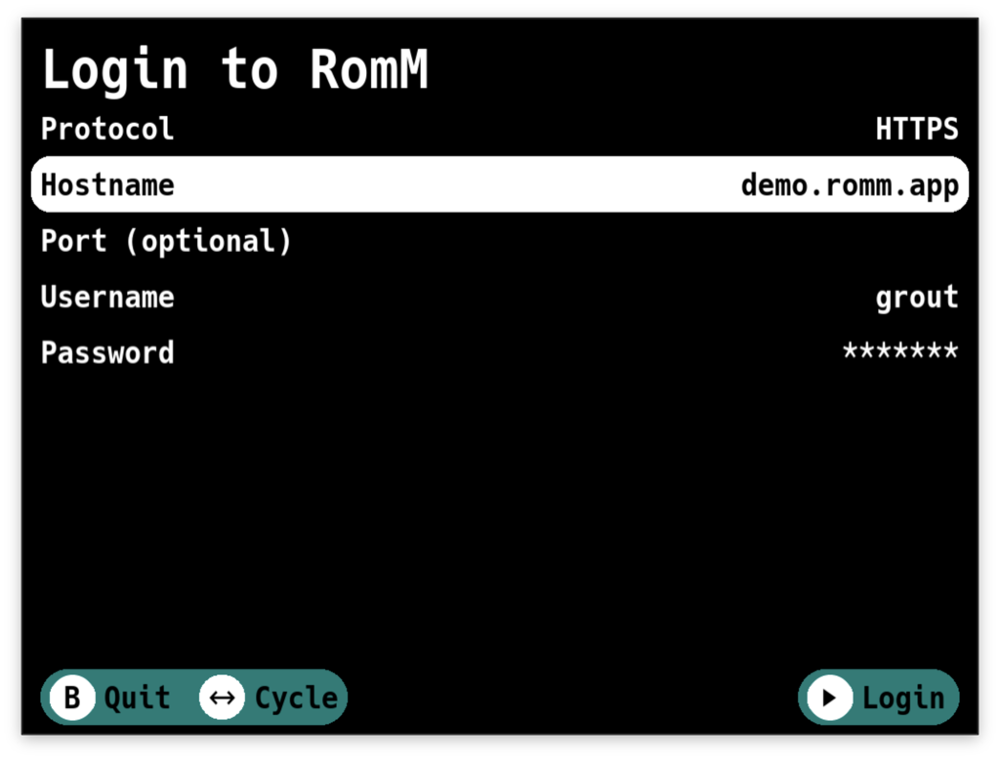

1. **Protocol** – Choose between HTTP and HTTPS.

2. **Hostname** – Enter your RomM server address without the protocol. For example, if your RomM is at
   `http://192.168.1.100`, just enter `192.168.1.100`. If it's `https://romm.example.com`, enter `romm.example.com`.

3. **Port (optional)** – If your RomM instance runs on a non-standard port, enter it here.

4. **Username** - Your RomM username.

5. **Password** - Your RomM password.

Use the left and right buttons to cycle through options for Protocol. For the text fields (Hostname, Username,
Password), pressing A will open an on-screen keyboard.

Press Start to log in. If your credentials are correct and Grout can reach your server, you'll move
to the next step. If something goes wrong, you'll get a message telling you what happened, and you can try again.

---

### Platform Directory Mapping

After logging in successfully for the first time, you'll need to map your RomM platforms to directories on your device.
This tells Grout where to put the games that you download.

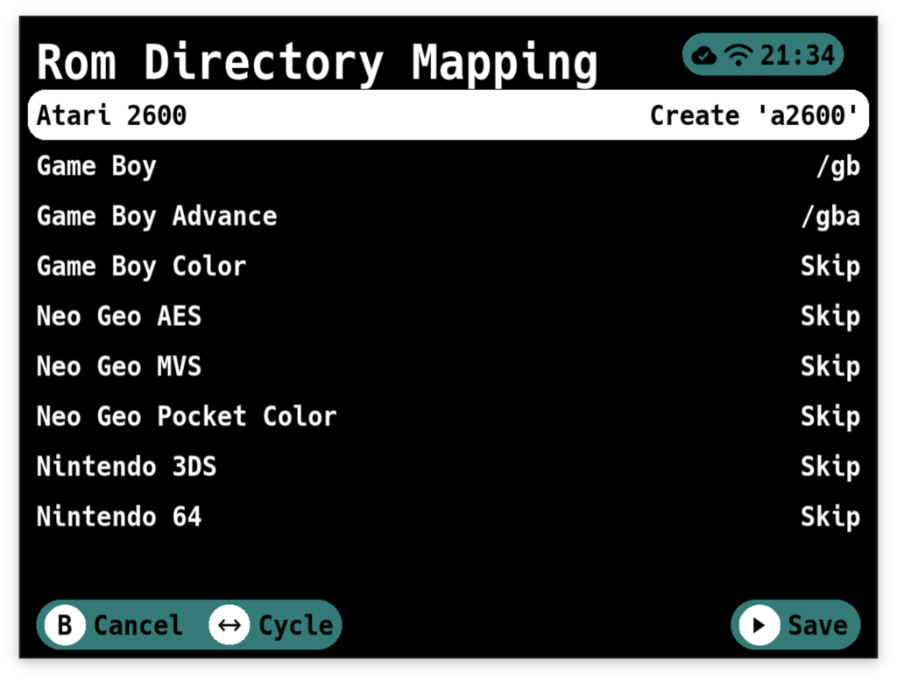

You'll see a list of all platforms from your RomM instance. For each one, you can select:

- **Skip** – Don't map this platform. Games from this platform won't be available to download.
- **Create {Directory Name}** – Create a new directory for this platform. Grout will automatically suggest directory
  names that match your custom firmware's expected structure.
- **/{Existing Directory}** – Map to an existing directory on your device.

Grout tries to be smart about this. If you already have a directory that matches the platform name, it'll be
pre-selected. If not, it'll suggest creating one with the correct name for your firmware.

Use left/right to cycle through the options for each platform. When you're happy with your mappings, press Start to
save. Grout will create any new directories you selected.

You can change these mappings later from the Settings menu.

---

### Main Menu – Platform Selection

Once you've logged in and set up your mappings, you'll land on the main menu. This is your home base for browsing your
RomM collection.

")

At the top, you'll see "Collections" (if you have any collections set up in RomM). Below that, you'll see all your RomM
platforms – NES, SNES, PlayStation, whatever you've got.

**Navigation:**

- Use Up/Down to scroll through platforms
- Press A to select a platform
- Press X to open Settings
- Press B to quit Grout

Selecting a platform will take you to the game list for that platform.

Selecting Collections will show you your RomM collections.

---

### Collections

Collections are custom groupings you can create in RomM - like "My Favorites," "Beat 'em Ups," or "Franchises."
They're a great way to organize games across multiple platforms.

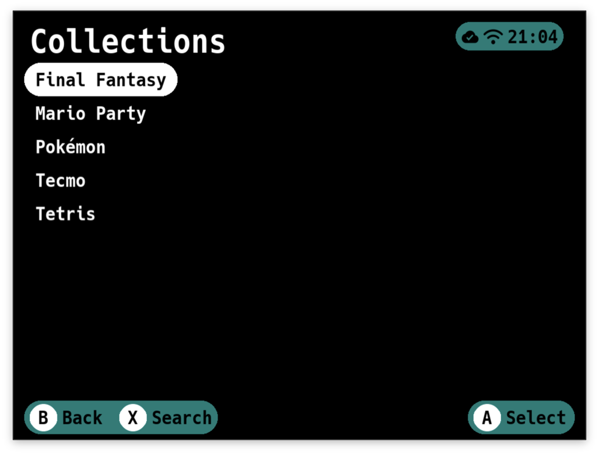

After selecting Collections from the main menu, you'll see all your collections. Pick one and press A.

If your collection has games from multiple platforms, you'll see a platform selection screen next. This lets you filter
the collection to just one platform at a time. If the collection is platform-specific, you'll go straight to the game
list.

> [!NOTE]
> Grout currently does not support smart collections nor autogenerated collections. There are issues tracking progress
> on these features.

> [!IMPORTANT]
> If you skipped a platform in the mapping screen, you won't see games for that platform in your collections.

---

### Game List

The game list is where you browse and select games to download.

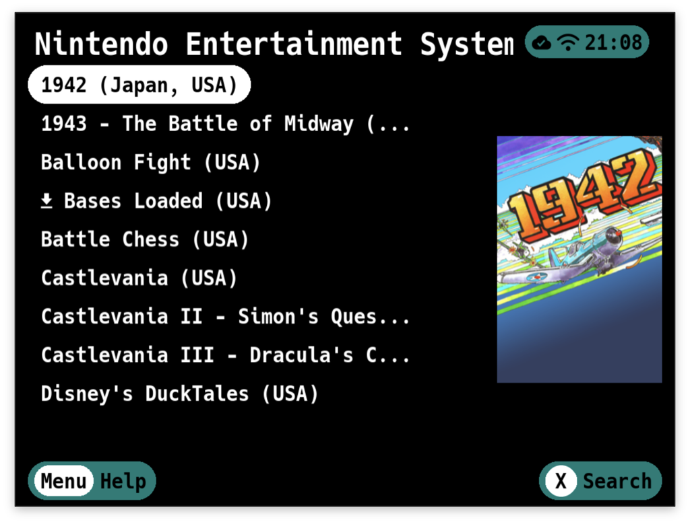

The title bar shows you where you are – either a platform name or a collection name.

If you entered a search query, you'll see `[Search: "your search term"] | Platform / Collection Name`.

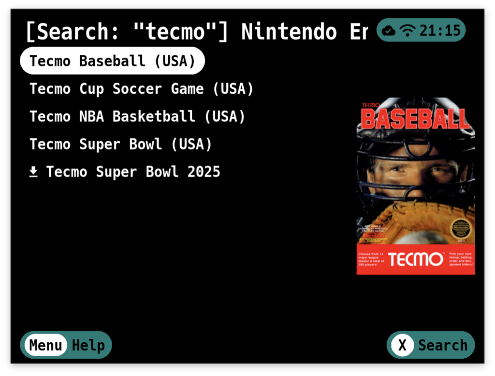

**Navigation and Selection:**

- Up/Down to scroll through games
- Left/Right to skip entire pages
- Press A to select a single game
- Press Select to enter multi-select mode, then use A to select/deselect games
- Press X to open the search keyboard
- Press B to go back

**Multi-Select Mode:**
Press Select once to enable multi-select. You'll see checkboxes appear next to each game. Now when you press A on a
game, it toggles selection instead of immediately downloading. This is perfect when you want to grab a bunch of games at
once.

Check all the ones you want, then press start to confirm your selections.

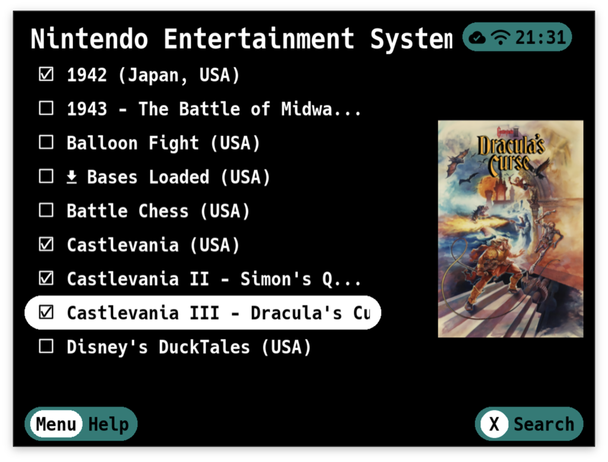

---

### Search

Press X from any game list to search.

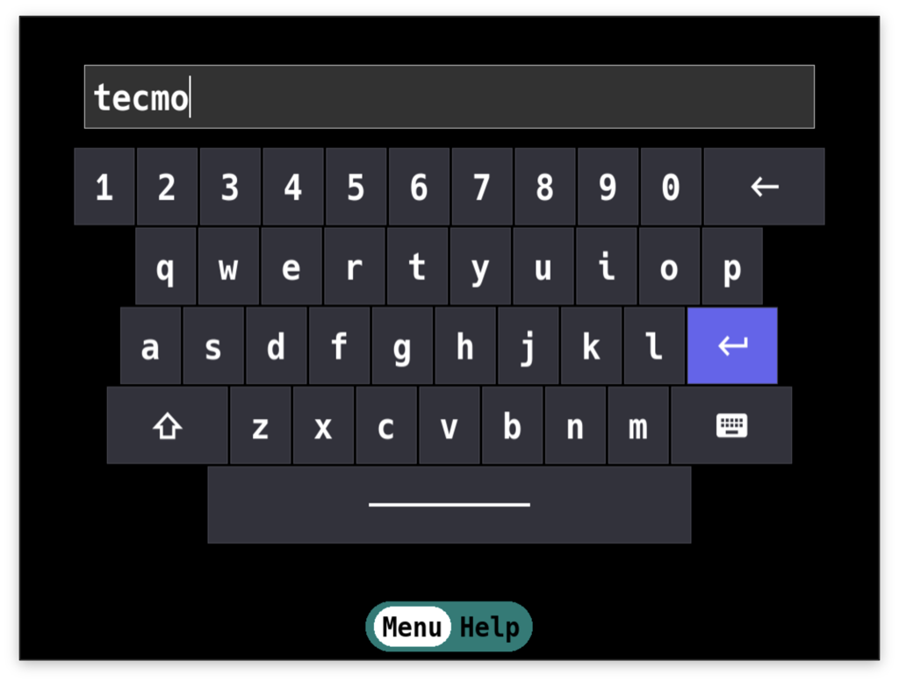

Type your search term using the on-screen keyboard and confirm. The game list will filter to show only matching titles.
The search is case-insensitive and matches anywhere in the game name.

To clear a search, press B to go back to the full results.

---

### Game Details

> [!IMPORTANT]
> This screen will only show if you've enabled "Show Game Details" in Settings.

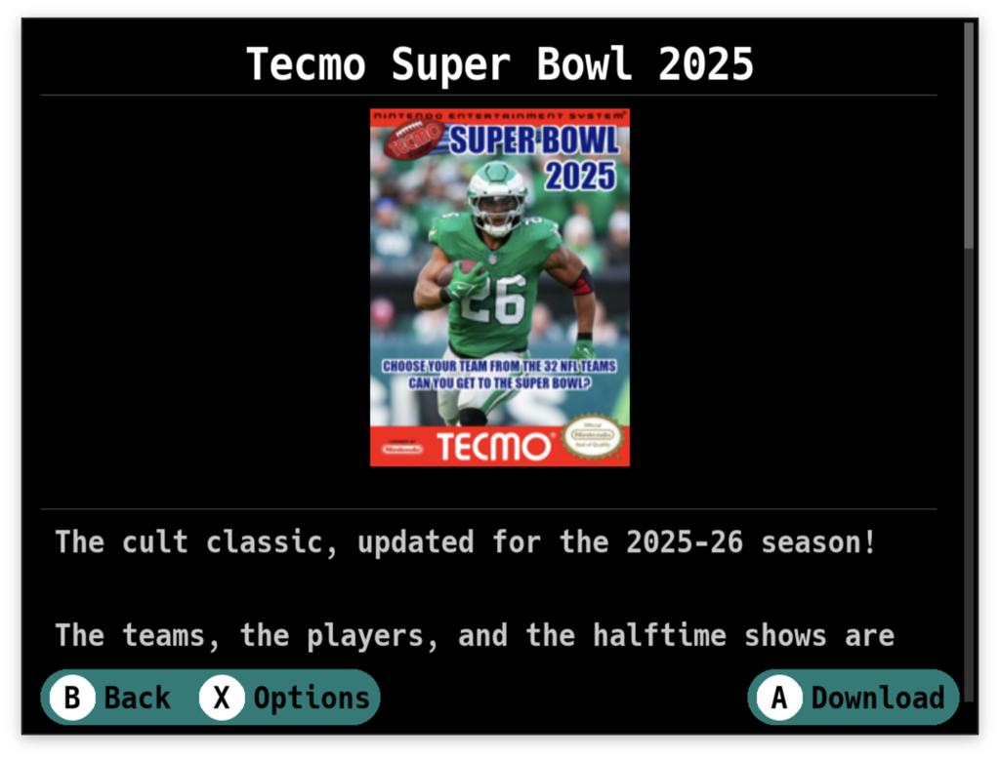

You'll see:

- **Cover art** – The game's box art (if available)
- **Summary** – A description of the game
- **Metadata** – Release date, genres, developers/publishers, game modes, regions, languages, and file size
- **Multi-file indicator** – If the game has multiple files (like multi-disc PlayStation games)
- **QR code** – Scan this to view the game's page on your RomM web interface

From here:

- Press A to download the game
- Press B to go back without downloading

---

### Downloading Games

After you've selected games (either from the game list or game details screen), the download manager kicks in.

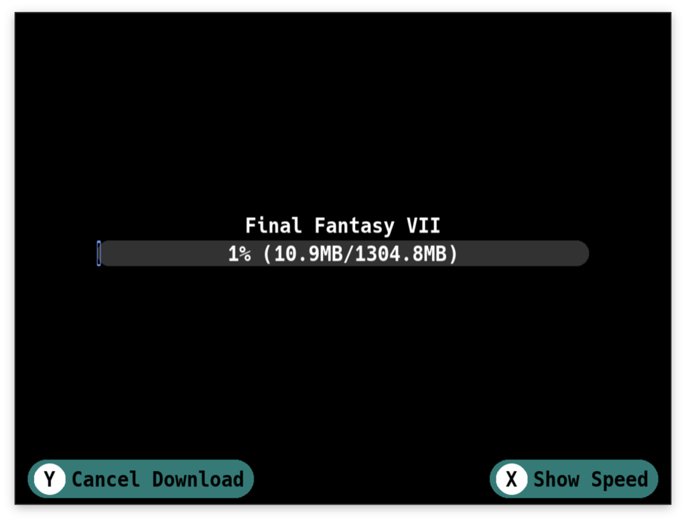

You'll see a progress bar and a list of games being downloaded. Grout downloads your ROMs directly from RomM to the
appropriate directory on your device. Press Y to cancel the download.

**What Happens During Download:**

1. **ROM files download** – The game files download to the correct platform directory you mapped earlier.

2. **Multi-file games get special treatment** – If you're downloading a multi-disc game, Grout downloads a zip file,
   extracts it, and creates an M3U playlist file so your emulator can handle disc switching.

3. **Artwork downloads** – If "Download Art" is enabled in Settings, Grout downloads box art for each game to your
   artwork directory after the ROMs finish.

4. **Automatic unzipping** – If "Unzip Downloads" is enabled in Settings, Grout automatically extracts any zipped ROMs
   and deletes the zip file.

If a download fails, Grout will show you which games had problems. Successfully downloaded games stay on your device,
failed downloads get cleaned up.

When everything's done, you're dropped back to the game list. The games you just downloaded are now on your device and
ready to play.

---

### Settings

Press X from the main platform menu to access Settings.

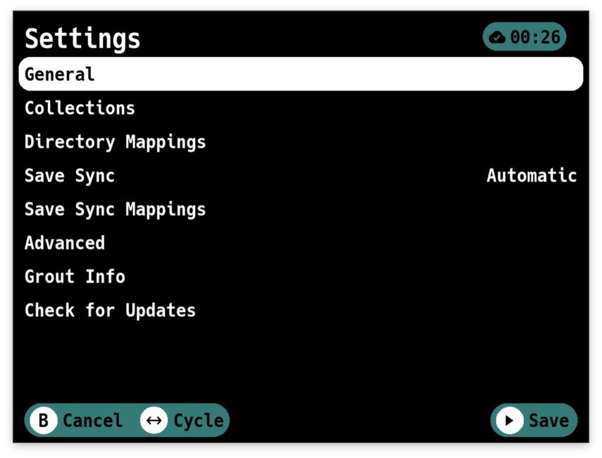

Here's what you can configure:

**Edit Directory Mappings** – Change which device directories are mapped to which RomM platforms. This takes you back to
the platform mapping screen that appeared during setup.

**Sync Saves** – Opens the save sync feature. This scans your device for save files and syncs them with your RomM
instance. More on this below.

**Show Game Details** - When enabled, selecting a game shows the details screen first. When disabled, selecting a game
immediately starts the download. If you know what you want and just want to grab it fast, turn this off.

**Download Art** – When enabled, Grout downloads box art for games after downloading the ROMs. The art goes into your
artwork directory so your frontend can display it.

**Unzip Downloads** - When enabled, Grout automatically extracts zipped ROMs after downloading. The zip file is deleted
after extraction. Useful if you prefer keeping ROMs uncompressed.

**API Timeout** – How long Grout waits for responses from your RomM server before giving up. If you have a slow
connection or are a completionist with a heavily loaded server, increase this. Options range from 15 to 300 seconds.

**Download Timeout** – How long Grout waits for a single ROM to download before giving up. Useful for large files or
slow connections. Options range from 15 to 120 minutes.

**Log Level** – Set to Debug if you're troubleshooting issues and want detailed logs. Otherwise, Error is fine.

Use left/right to cycle through options. Press Start to save your changes, or B to cancel.

---

### Save Sync

[!IMPORTANT]
> This feature requires RomM v4.5.0 as it relies on an endpoint released in this version.

Save Sync is one of Grout's standout features. It lets you keep your game saves synchronized between your RomM server
and your handheld device.

Access it by going to Settings and selecting "Sync Saves."

**How It Works:**

Grout scans your device's save directories and compares them to the saves stored in RomM (associated with your RomM user
account). For each save file it finds, it checks:

1. Does a corresponding ROM exist in RomM?
2. Is there a save file in RomM for this game?
3. Which file is newer – local or remote?

Based on this comparison, Grout decides what to do:

**Downloading Saves:**

- If RomM has a save, but you don't have one locally, it downloads the save.
- If both your device and RomM have a save, and RomM's is newer, Grout backs up your local save (to a hidden `.backup`
  folder
  with a timestamp) and downloads the newer one.

**Uploading Saves:**

- If you have a save locally but RomM doesn't, it uploads your save.
- If both you and RomM have a save, and yours is newer, it uploads your save to RomM.

In both cases the last modified timestamp is appended to the end of the uploaded save's filename.

**Emulator Selection:**

Some platforms (like Game Boy Advance on muOS) have multiple emulator options, each with its own save directory.

If Grout detects that there is ambiguity, it'll ask you which emulator's saves you want to sync.

Choose the emulator you're actually using, and Grout will sync saves from that directory.

**Sync Results:**

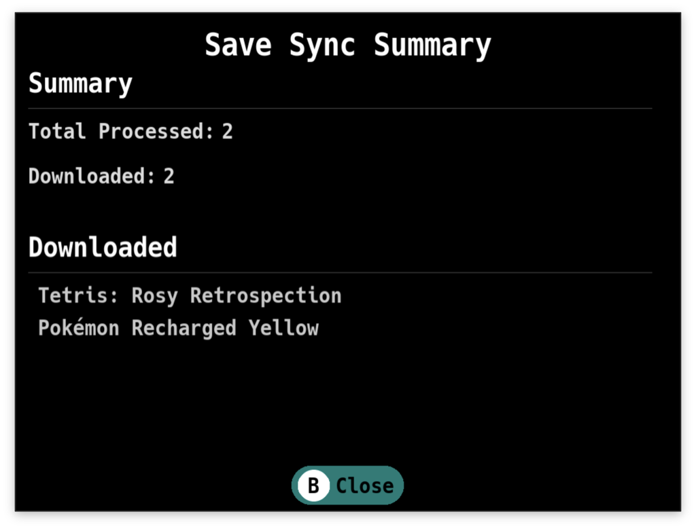

When the sync completes, you'll see a summary showing:

- Games that had saves downloaded
- Games that had saves uploaded
- Any unmatched save files (local saves that don't correspond to any game in RomM)
- Any errors that occurred

**Important Notes:**

- Save Sync works with save files (.sav, .srm, etc.) but NOT save states.

- If you use save states with autoload enabled, you might need to disable autoload or delete the state after downloading
  a save file, otherwise the emulator will load the state instead of the save.

- Saves are tied to your RomM user account. If you're sharing a RomM account with someone, be aware that syncing might
  overwrite each other's saves.

- Backups of overwritten saves are kept in `saves/.backup/` with timestamps, so you can recover them if needed.

---

## Installation

### NextUI Setup

Grout has been tested on the following devices running NextUI:

- TrimUI Brick
- TrimUI Smart Pro

**Installation Steps:**

1. Ensure your TrimUI device has NextUI installed on an SD card.
2. Connect your device to a Wi-Fi network.
3. Install Grout using one of these methods:
    - **Recommended:** Use the NextUI Pak Store found in the `Tools` menu. Navigate to the `ROM Management` category and
      install Grout.
    - **Manual:** Download
      the [latest Grout release](https://github.com/rommapp/grout/releases/latest/download/Grout.pak.zip) for NextUI,
      unzip it, and place the `Grout.pak` directory into `SD_ROOT/Tools/tg5040`.
4. Launch Grout from the `Tools` menu and enjoy!

---

### muOS Setup

Grout has been tested on the following devices running muOS 2508.4 Loose Goose:

**Anbernic:**

- RG34XX
- RG35XX-H
- RG35XXSP
- RG40XXV

**TrimUI:**

- Brick
- Smart Pro

Please help verify compatibility on other devices by reporting your results!

**Installation Steps:**

1. Ensure your device is running muOS.
2. Download the [latest Grout release](https://github.com/rommapp/grout/releases/latest/download/Grout.muxapp) for muOS.
3. Transfer the `Grout.muxapp` file to an `ARCHIVE` folder on your device:
    - `/mnt/mmc/ARCHIVE` or `/mnt/sdcard/ARCHIVE`
4. Open Applications and launch Archive Manager.
5. Select `[SDX-APP] Grout` from the list and let it extract to your applications directory.
6. Exit Archive Manager.
7. Find an [input mapping config](/.github/resources/input_mappings) for your device.
    - If one does not exist, try a config for a different device.
    - If that does not
      work, [create an issue](https://github.com/rommapp/grout/issues/new?template=button-mapping-request.md) to request
      a mapping for your device.
8. Save the input mapping JSON file as `input_mapping.json` and transfer it to the Grout application folder:
    - `/mnt/mmc/MUOS/application/Grout` or `/mnt/sdcard/MUOS/application/Grout`
9. Select `Apps` on the main menu, launch Grout, and enjoy!

---

## Need Help? Found a Bug? Have an Idea?

Please [create an issue](https://github.com/rommapp/grout/issues/new/choose) and fill out the template completely.

---

## Spread Joy!

A significant amount of time has been spent building Grout.

If you enjoy using Grout and feel inclined to pay it forward, go do something nice for someone! ❤️

✌🏻

<!-- Badges -->

[license-badge-img]: https://img.shields.io/github/license/rommapp/grout?style=for-the-badge&color=007C77

[license-badge]: LICENSE

[release-badge-img]: https://img.shields.io/github/v/release/rommapp/grout?sort=semver&style=for-the-badge&color=007C77

[release-badge]: https://github.com/rommapp/grout/releases

[stars-badge-img]: https://img.shields.io/github/stars/rommapp/grout?style=for-the-badge&color=007C77

[stars-badge]: https://github.com/rommapp/grout/stargazers

[downloads-badge-img]: https://img.shields.io/github/downloads/rommapp/grout/total?style=for-the-badge&color=007C77

[downloads-badge]: https://github.com/rommapp/grout/releases

[discord-badge-img]: https://img.shields.io/badge/discord-7289da?style=for-the-badge&color=007C77

[discord-badge]: https://discord.gg/P5HtHnhUDH

<!-- Links -->

[discord-invite]: https://invidget.switchblade.xyz/P5HtHnhUDH

[discord-invite-url]: https://discord.gg/P5HtHnhUDH

[oc-donate-img]: https://opencollective.com/romm/donate/button.png?color=blue

[oc-donate]: https://opencollective.com/romm
