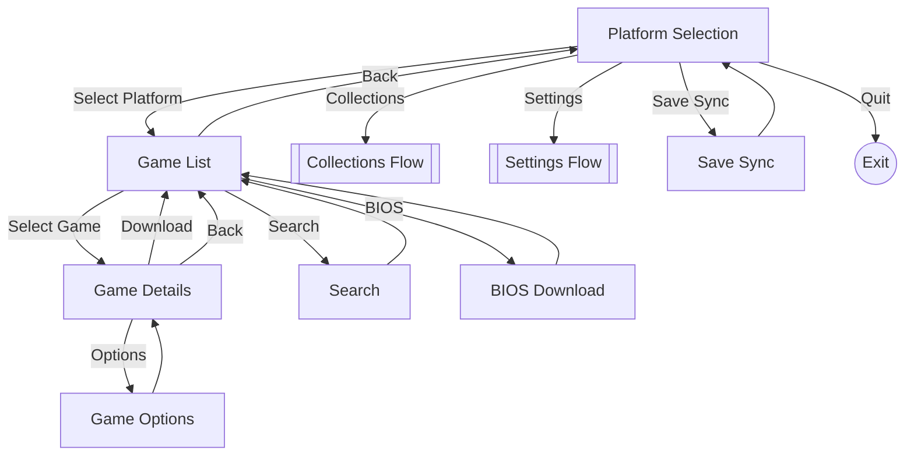
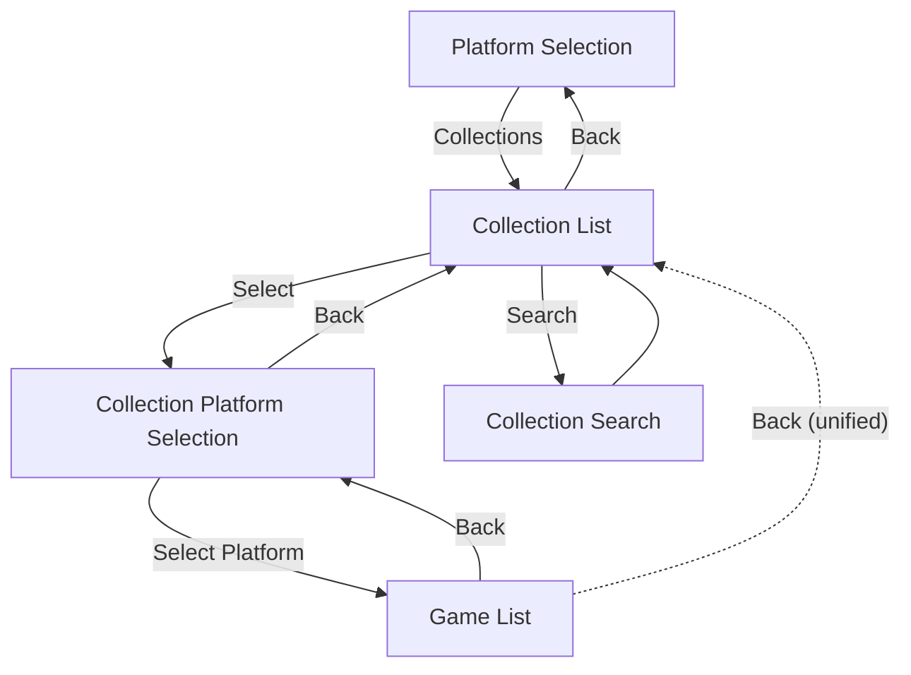
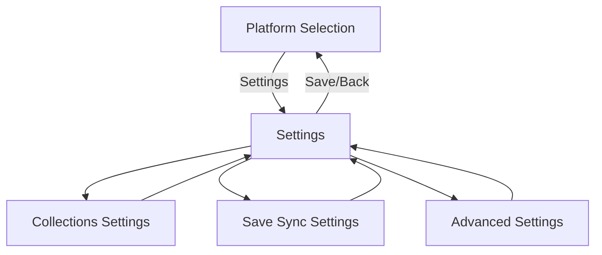
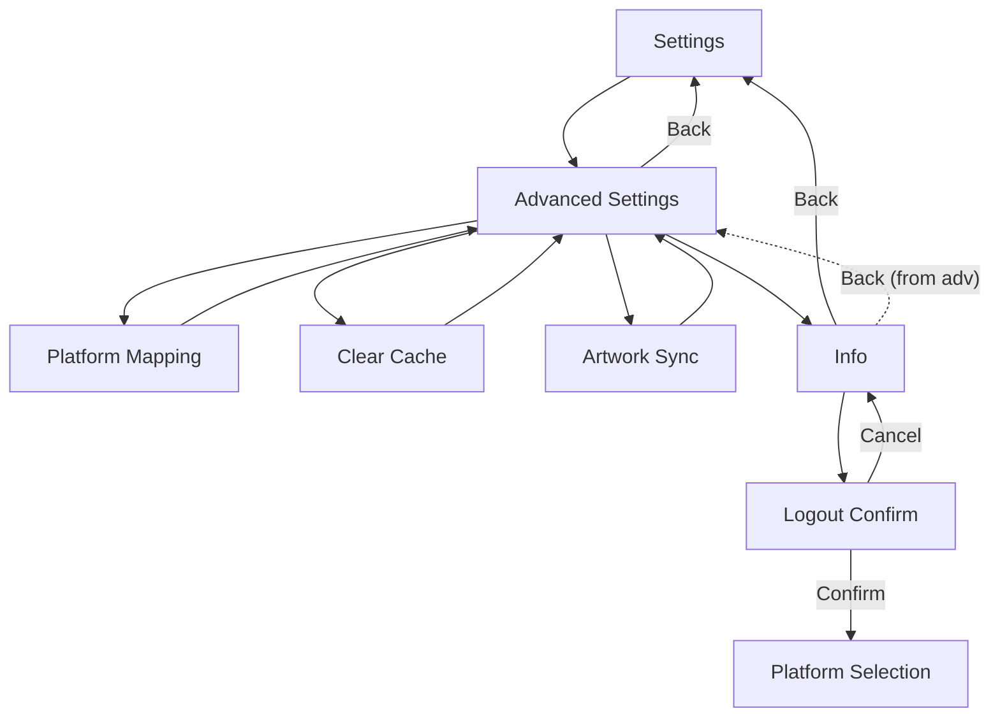

# Grout State Machine

This document shows the navigation flow between screens in Grout.

## Main Flow



## Collections Flow



## Settings Flow



## Advanced Settings Flow



## State Descriptions

| State | Description |
|-------|-------------|
| Platform Selection | Main menu showing platforms and collections |
| Game List | List of games for selected platform/collection |
| Game Details | Detailed view with metadata and download |
| Game Options | Per-game settings (save directory) |
| Search | On-screen keyboard for game search |
| Collection List | List of available collections |
| Collection Platform Selection | Platform filter within a collection |
| Collection Search | On-screen keyboard for collection search |
| Settings | Main settings menu |
| Collections Settings | Collection display options |
| Save Sync Settings | Per-platform save directory config |
| Advanced Settings | Timeouts, cache, mappings |
| Platform Mapping | Configure ROM directory mappings |
| Clear Cache | Confirm cache clearing |
| Artwork Sync | Pre-cache artwork for all games |
| Info | App info and logout option |
| Logout Confirmation | Confirm logout action |
| Save Sync | Manual save synchronization |
| BIOS Download | Download BIOS files |

## Navigation State

The FSM maintains state in a single `NavState` struct:

```go
type NavState struct {
    // Game browsing
    CurrentGames, FullGames []romm.Rom
    SearchFilter            string
    HasBIOS                 bool
    GameListPos             ListPosition

    // Collections
    CollectionSearchFilter  string
    CollectionGames         []romm.Rom
    CollectionListPos       ListPosition
    CollectionPlatformPos   ListPosition

    // List positions
    PlatformListPos         ListPosition
    SettingsPos             ListPosition
    CollectionsSettingsPos  ListPosition
    AdvancedSettingsPos     ListPosition

    // Flags
    QuitOnBack, ShowCollections bool
    InfoPreviousState           gaba.StateName
}
```
