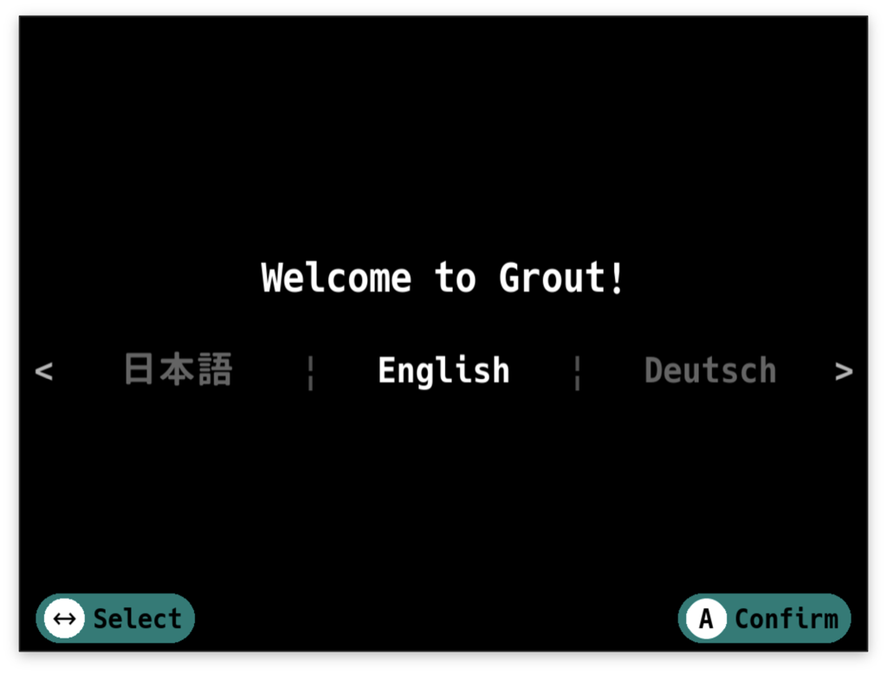
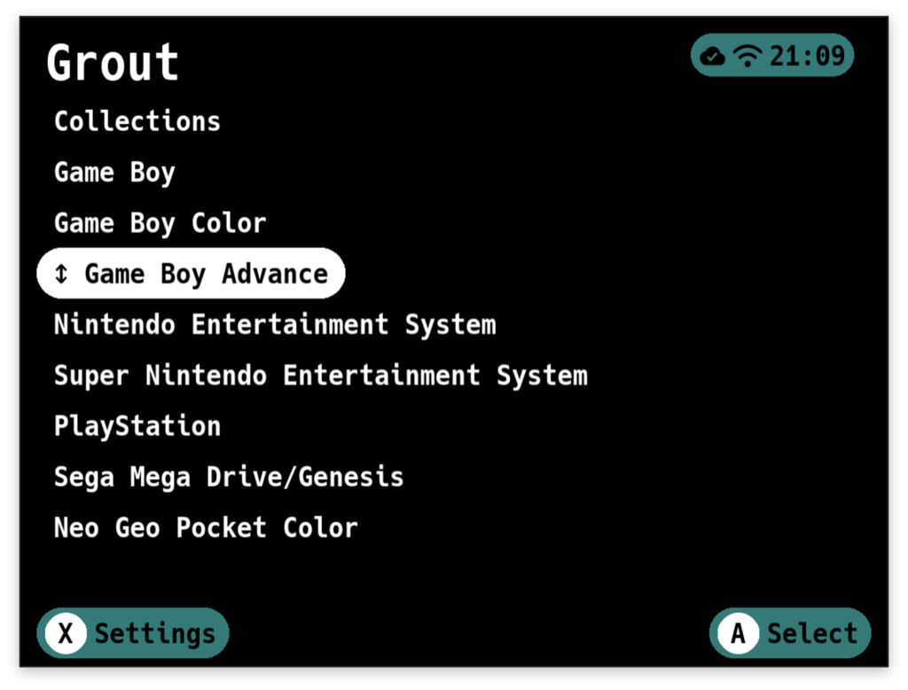
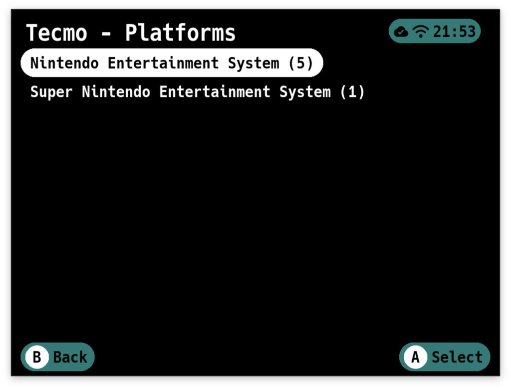
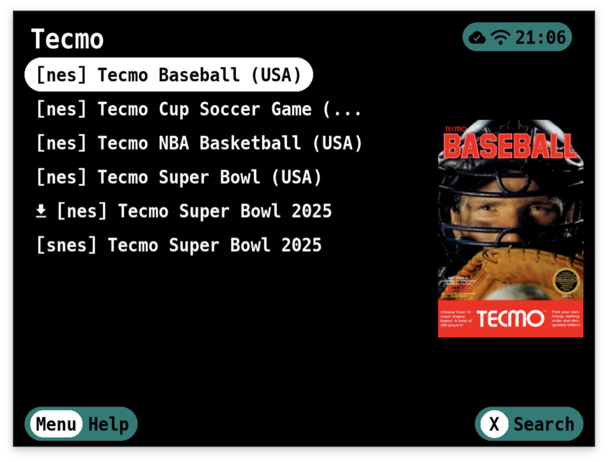
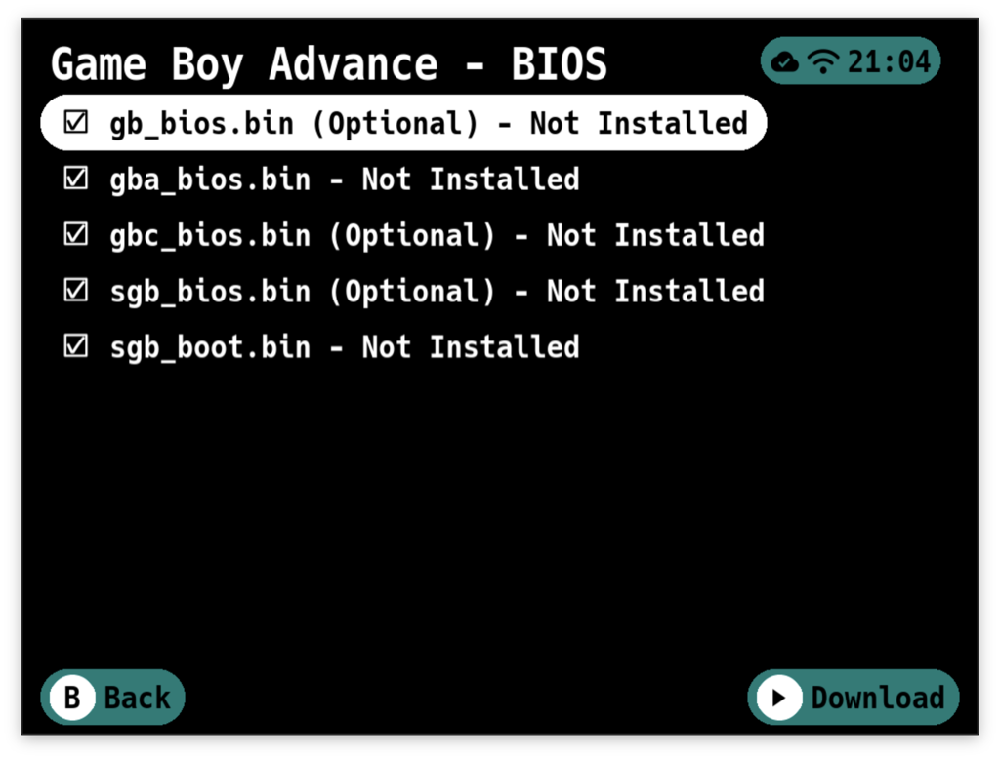
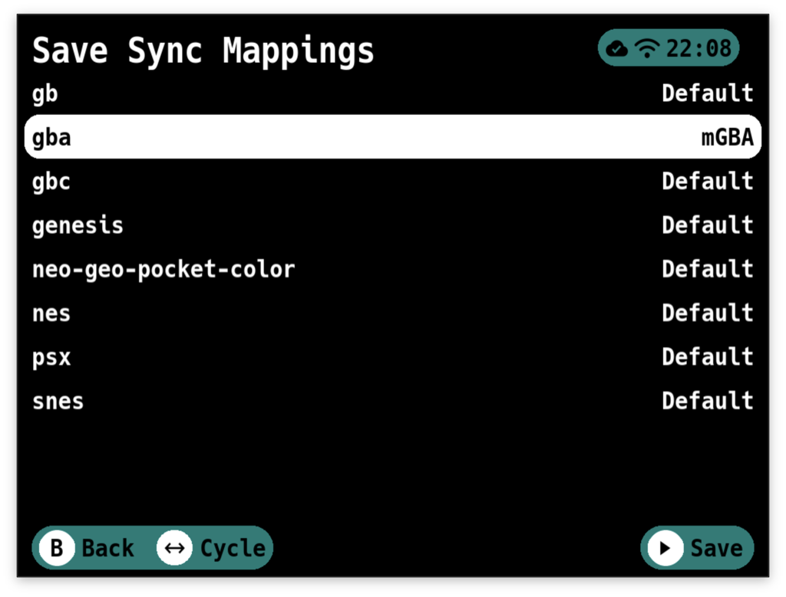

# Grout User Guide

This guide walks you through using Grout to download games from your RomM instance.

## Table of Contents

- [First Launch and Login](#first-launch-and-login)
- [Platform Directory Mapping](#platform-directory-mapping)
- [Main Menu - Platform Selection](#main-menu--platform-selection)
- [Collections](#collections)
- [Game List](#game-list)
- [Search](#search)
- [Game Details](#game-details)
- [Downloading Games](#downloading-games)
- [BIOS Files](#bios-files)
- [Settings](#settings)
    - [General Settings](#general-settings)
    - [Collections Settings](#collections-settings)
    - [Advanced Settings](#advanced-settings)
- [Save Sync](#save-sync)
- [Advanced Configuration](#advanced-configuration)

---

## First Launch and Login

### Language Selection

When you first launch Grout, you'll be asked to select your preferred language. Grout supports:

- English
- Deutsch (German)
- Español (Spanish)
- Français (French)
- Italiano (Italian)
- Português (Portuguese)
- Русский (Russian)
- 日本語 (Japanese)

Use `Left/Right` to cycle through the available languages. Press `A` to confirm your selection.

You can change your language later from the Settings menu.

---

### Login

1. **Protocol** – Choose between HTTP and HTTPS.
2. **Hostname** – Enter your RomM server address without the protocol.
3. **Port (optional)** – If your RomM instance runs on a non-standard port, enter it here.
4. **Username** - Your RomM username.
5. **Password** - Your RomM password.

Use the left and right buttons to cycle through options for Protocol. For the text fields (Hostname, Username,
Password), pressing `A` will open an on-screen keyboard.

Press `Start` to login. If your credentials are correct and Grout can reach your server, you'll move
to the next step. If something goes wrong, you'll get a message telling you what happened, and you can try again.

> [!NOTE]
> **OIDC Users:** If your RomM instance uses OIDC authentication, you can still use Grout by setting a password for your
> user account. Grout will support API Keys once they are available in RomM. For more details,
> see [this GitHub issue](https://github.com/rommapp/romm/issues/1767#issuecomment-2744215262).

---

## Platform Directory Mapping

On this screen, you map your RomM platforms to directories on your device.
This tells Grout where to put the games that you download.

You'll see a list of all platforms from your RomM instance. For each one, you can select:

- **Skip** – Don't map this platform. Games from this platform won't be available to download.
- **Create {Directory Name}** – Create a new directory for this platform. Grout will automatically suggest directory
  names that match your custom firmware's expected structure.
- **/{Existing Directory}** – Map to an existing directory on your device.

Grout tries to be smart about this. If you already have a directory that matches the platform name, it'll be
pre-selected. If not, it'll suggest creating one with the correct name for your firmware.

Use left/right to cycle through the options for each platform. When you're happy with your mappings, press `Start` to
save. Grout will create any new directories you selected.

You can change these mappings later from the Settings menu.

---

## Main Menu – Platform Selection

")

At the top, you'll see "Collections" (if you have any collections set up in RomM). Below that, you'll see all your RomM
platforms – NES, SNES, PlayStation, whatever you've got.

**Navigation:**

- `Up/Down` to scroll through platforms
- `A` to select a platform or collection
- `X` to open Settings
- `Y` to open the Save Sync menu (when Save Sync is enabled in Manual mode, or when issues occur in Automatic mode)
- `Select` to enter reordering mode
- `B` to quit Grout

**Reordering Platforms:**

Press `Select` to enter reordering mode. `↕` will appear next to the currently selected platform.

While in this mode:

- `Up/Down` to move the platform one position
- `Left/Right` to move the platform one page at a time
- `A` to place the platform into its new position

Your custom platform order is automatically saved to the config and will persist across sessions.

---

## Collections

Grout has two views for collections. You can choose this view in the Settings → Collections menu.

**Platform** – After selecting a collection, you'll see a platform selection screen showing all platforms in that
collection. Select a platform to view games from only that platform.

**Unified** – After selecting a collection, you'll immediately see all games from all platforms with platform slugs
shown as prefixes (e.g., `[nes] Tetris`, `[snes] Tetris Battle Gaiden`)

> [!WARNING]
> If you skipped a platform in the mapping screen, you won't see games for that platform in your collections.

> [!TIP]
> Regular collections, smart collections, and virtual collections can be toggled on/off in settings.

---

## Game List

The title bar shows you where you are – either a platform name or a collection name.

If you entered a search query, you'll see `[Search: "your search term"] | Platform / Collection Name`.

**Navigation and Selection:**

- `Up/Down` to scroll through games
- `Left/Right` to skip entire pages
- `A` to select a single game
- `Select` to enter multi-select mode, then use `A` to select/deselect games
- `X` to open the search keyboard
- `B` to go back

**Multi-Select Mode:**
Press `Select` once to enable multi-select. You'll see checkboxes appear next to each game. Now when you press `A` on a
game, it toggles selection instead of immediately downloading. This is perfect when you want to grab a bunch of games at
once.

Check all the ones you want, then press `Start` to confirm your selections.

> [!TIP]
> Box art must be enabled in settings for it to appear.

---

## Search

Press `X` from any game list to search.

Type your search term using the on-screen keyboard and confirm. The game list will filter to show only matching titles.
The search is case-insensitive and matches anywhere in the game name.

To clear a search and return to the full list, press `B`.

---

## Game Details

> [!TIP]
> This screen will only show if you've enabled "Game Details" in Settings.

You'll see:

- **Cover art** – The game's box art (if available)
- **Summary** – A description of the game
- **Metadata** – Release date, genres, developers/publishers, game modes, regions, languages, and file size
- **Multi-file indicator** – If the game has multiple files (like multi-disc PlayStation games)
- **QR code** – Scan this to view the game's page on your RomM web interface

From here:

- `A` to download the game
- `X` to open Game Options
- `B` to go back without downloading

### Game Options

- **Save Directory** – Choose which emulator's save folder this game should use. This overrides the platform-wide
  setting configured in Save Sync Mappings. When changed, Grout automatically moves existing save files to the new
  location. This is useful when you use different emulators for specific games within the same platform.

---

## Downloading Games

After you've selected games (either from the game list or game details screen), the download manager kicks in.

You'll see a progress bar and a list of games being downloaded. Grout downloads your ROMs directly from RomM to the
appropriate directory on your device. Press `Y` to cancel the download.

**What Happens During Download:**

1. **ROM files are downloaded** – The game files are saved to the correct platform directory you mapped earlier.

2. **Multi-file games are extracted automatically** – If you're downloading a multi-disc game, Grout downloads a zip
   file, extracts it, and creates an M3U playlist file so your emulator can handle disc switching.

3. **Artwork is downloaded** – If "Download Art" is enabled in Settings, Grout downloads box art for each game to your
   artwork directory after the ROMs finish.

4. **Zipped files are extracted automatically** – If "Zipped Downloads" is set to "Uncompress" in Settings, Grout
   will extract the files to the configured ROM directory and then delete the zip file.

If a download fails, Grout will show you which games had problems and clean up any leftover cruft.

When everything's done, you're dropped back to the game list. The games you just downloaded are now on your device and
ready to play.

---

## BIOS Files

Many emulators require BIOS files to function properly. Grout can download these files directly from your RomM server to
the correct location on your device.

### Accessing BIOS Downloads

From the main main menu, press `A` on a platform that requires BIOS files. If BIOS files are available for that
platform in your RomM library, you'll see a "BIOS" option in the platform submenu.

---

## Settings

Press `X` from the main main menu to access Settings.

### Main Settings

**General** - Opens a sub-menu for general display and download options.
See [General Settings](#general-settings) below.

**Collections** - Opens a sub-menu for configuring collection display options.
See [Collections Settings](#collections-settings) below.

**Directory Mappings** – Change which device directories are mapped to which RomM platforms. This takes you back to
the platform mapping screen that appeared during setup.

**Save Sync** - Controls save synchronization behavior:

- **Off** – Save sync is completely disabled
- **Manual** – Save sync is available via the `Y` button from the main menu
- **Automatic** – Grout automatically syncs saves in the background when you launch the app. A cloud icon in the status
  bar shows sync progress. If issues are detected, a `Y` button appears to access manual sync.

**Save Sync Mappings** - Opens a sub-menu where you can configure the default save directory for each platform. This is
useful for platforms with multiple emulators (e.g., GBA on muOS), allowing you to set which emulator's save folder
should be used for syncing. Only visible when Save Sync is enabled. Individual games can override this setting via
Game Options.

**Advanced** - Opens a sub-menu for advanced configuration options. See [Advanced Settings](#advanced-settings) below.

**Grout Info** – View version information, build details, server connection info, and the GitHub repository QR code.

**Check for Updates** - Will allow Grout to update itself. This feature is only present on muOS and Knulli as NextUI has
the Pak Store.

### General Settings

This sub-menu contains general display and download settings:

**Box Art** - When set to show, Grout displays cover art thumbnails next to game names in the game list. Artwork is
automatically cached in the background as you browse. This provides a visual preview similar to your frontend's game
library view.

**Game Details** - When enabled, selecting a game shows a detailed information screen with cover art, summary,
metadata, and game options before downloading. When disabled, selecting a game immediately starts the download.

**Downloaded Games** - Controls how already-downloaded games appear in game lists:

- **Do Nothing** – No special treatment for downloaded games
- **Mark** – Downloaded games are marked with a download icon
- **Filter** – Downloaded games are hidden from the list entirely

**Download Art** – When enabled, Grout downloads box art for games after downloading the ROMs. The art goes into your
artwork directory so your frontend can display it.

**Zipped Downloads** - Controls what happens when downloading zipped ROM files:

- **Uncompress** – Grout automatically extracts zipped ROMs after downloading. The zip file is deleted after extraction.
- **Do Nothing** – Keep the downloaded zip file as-is without extracting.

**Language** – Grout is localized! Choose from English, Deutsch, Español, Français, Italiano, Português, Русский, or
日本語. If you notice an issue with a translation or want to help by translating, please let us know!

### Collections Settings

This sub-menu contains all collection-related configuration:

**Collections** - When set to show, Grout displays regular collections in the main menu.

**Smart Collections** - When set to show, Grout displays smart collections in the main menu.

**Virtual Collections** - When set to show, Grout displays virtual collections in the main menu.

**Collection View** - Controls how collections display their games:

- **Platform** – After selecting a collection, you'll see a platform selection screen showing all platforms in that
  collection. Select a platform to view games from only that platform.
- **Unified** – After selecting a collection, you'll immediately see all games from all platforms with platform slugs
  shown as prefixes (e.g., `[nes] Tecmo Bowl`, `[snes] Super Mario World`)

### Advanced Settings

This sub-menu contains advanced configuration and system settings:

**Preload Artwork** - Pre-cache artwork for all games across all mapped platforms. Grout scans your platforms, identifies
games without cached artwork, and downloads cover art from RomM. Useful for pre-caching after adding new games.

**Refresh Cache** - Re-sync cached data from RomM. Select which caches to refresh: Games Cache (platform and ROM data)
or Collections Cache. Shows when each cache was last refreshed.

**Download Timeout** – How long Grout waits for a single ROM to download before giving up. Useful for large files or
slow connections. Options range from 15 to 120 minutes.

**API Timeout** – How long Grout waits for responses from your RomM server before giving up. If you have a slow
connection or are a completionist with a heavily loaded server, increase this. Options range from 15 to 300 seconds.

**Kid Mode** – Hides some of the more advanced settings. When enabled, kid mode will hide the settings screen, BIOS
screen, and game option screen. You can turn this off on a per-session basis by pressing `L1`, `R1` and `Menu` during
the
Grout splash screen. To turn off permanently, return to this menu.

**Log Level** – Set to Debug if you're troubleshooting issues and want detailed logs. Otherwise, Error is fine.

---

Use `Left/Right` to cycle through options. Press `Start` to save your changes, or `B` to cancel.

---

## Save Sync

Save Sync keeps your game saves synchronized between your RomM server and your handheld device.

### Sync Modes

Grout offers two sync modes, configurable in Settings:

**Manual Mode:**

- Press `Y` from the main menu to access save sync
- You control when syncing happens
- A sync summary is displayed after completion

**Automatic Mode:**

- Grout automatically syncs saves in the background when you launch the app
- A cloud icon appears in the status bar showing sync progress:
    - **Cloud with up arrow** – Upload in progress
    - **Cloud with down arrow** - Download in progress
    - **Cloud with checkmark** – Sync completed successfully

### How It Works

When you run Save Sync, Grout:

1. Scans your device for games and their save files
2. Matches them with corresponding ROMs in RomM
3. Compares local and remote save files
4. Syncs saves based on which version is newer

### Sync Logic

For each mapped ROM file found on your device, Grout determines what action to take:

**When RomM has no save:**

- Your local save, if present, is uploaded to RomM (with timestamp appended to filename)

**When you have no local save:**

- RomM's save, if present, is downloaded to your device

**When both exist:**

- The newer save (based on last modified time) determines the action.
- If the local save is newer, it is uploaded to RomM with the last modified timestamp appended to the filename
- If the RomM save is newer
    - The current local save is backed up to `.backup/` within the platform's save directory
    - The RomM save is downloaded to your device

**When there's no matching ROM in RomM:**

- The save file is reported as "unmatched" in the sync results

### Sync Results

After syncing, you'll see a summary showing:

- Downloaded saves (from RomM to device)
- Uploaded saves (from device to RomM)
- Unmatched saves (local saves without corresponding ROMs in RomM)
- Any errors that occurred

### Important Notes

- **Save files only:** This works with save files, **NOT** save states
- **Save states conflict:** If you use save states with autoload enabled, disable autoload or delete the state after
  downloading a save, otherwise the emulator will load the state instead
- **User-specific:** Saves are tied to your RomM user account – keep this in mind if you share your RomM account

---

## Advanced Configuration

### Override Files

For advanced users and developers, Grout supports overriding embedded configuration files with local copies. This allows
you to test new platform mappings, add custom BIOS requirements, or modify input mappings without recompiling the
application.

For complete documentation on how to use override files, see [OVERRIDES.md](OVERRIDES.md).
