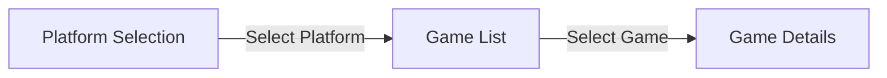
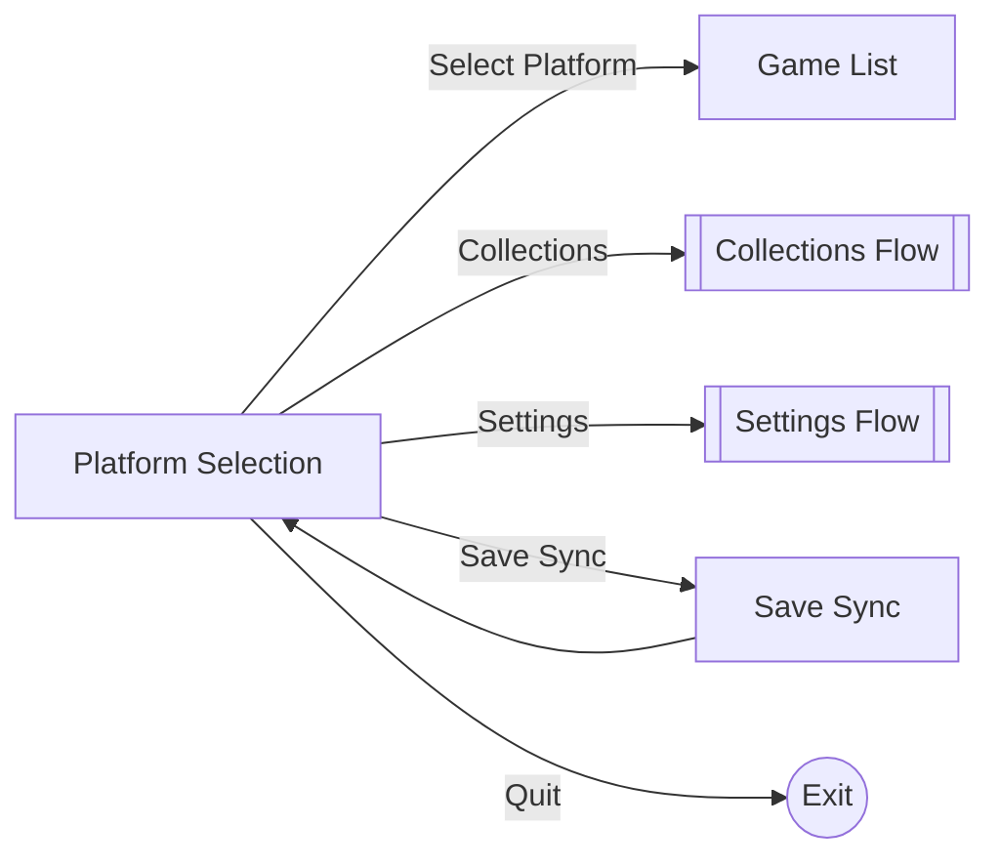
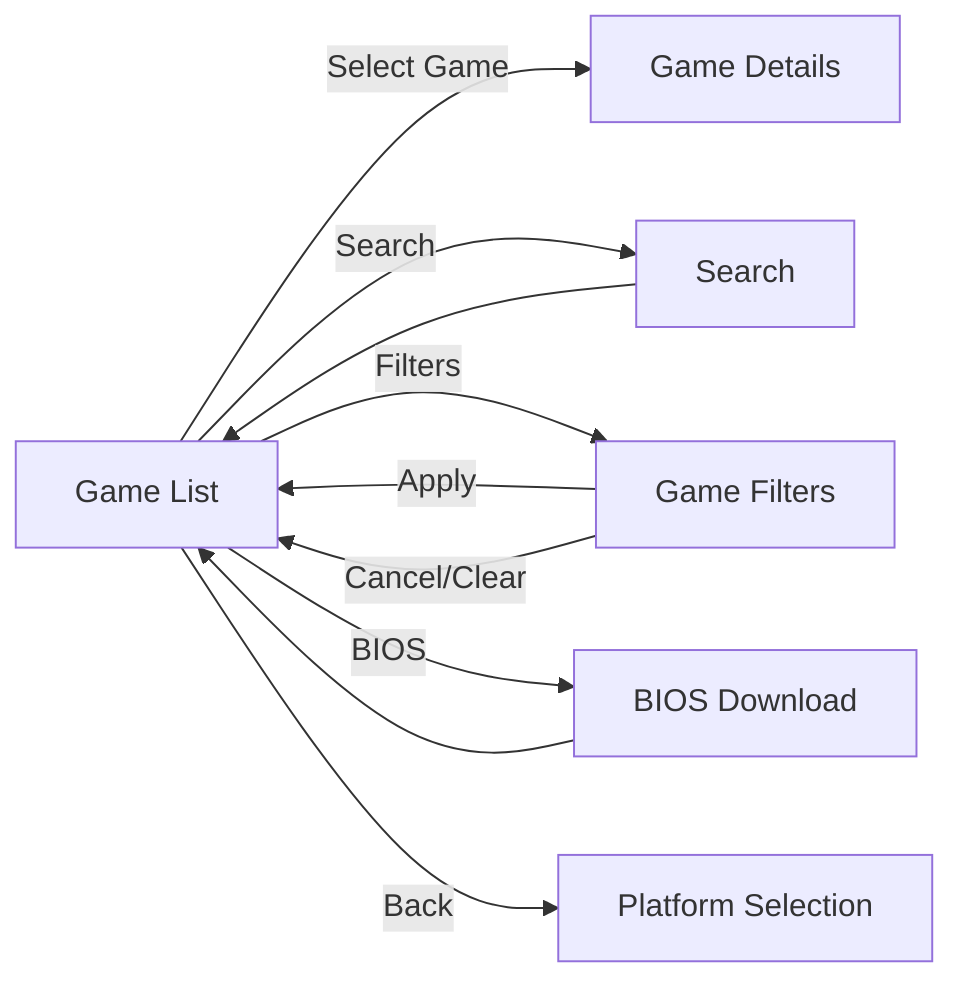
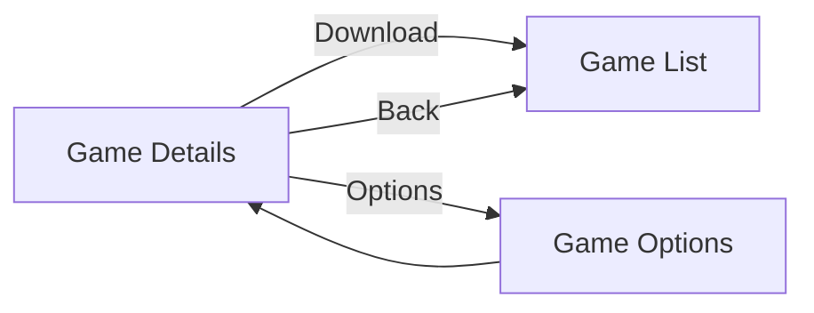
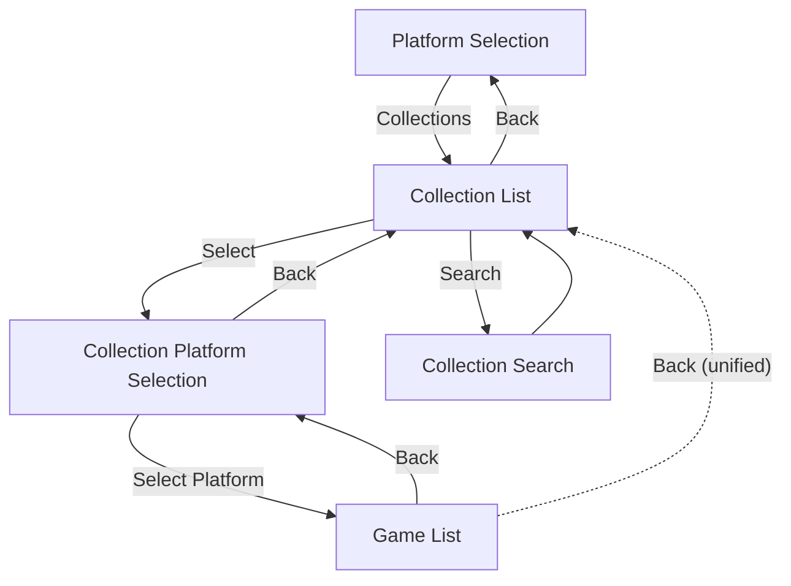
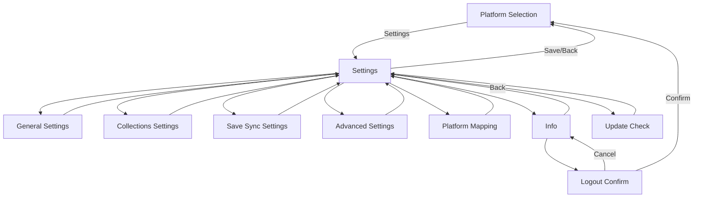
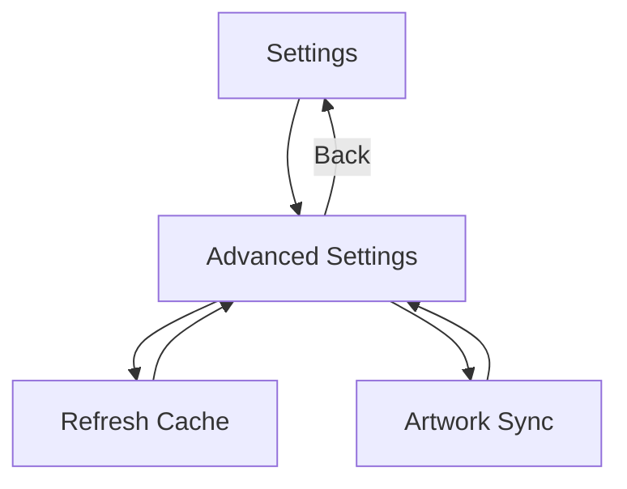

# State Machine Reference

This document shows the navigation flow between screens in Grout.

---

## Overview

## Platform Selection

## Game List

## Game Details

---

## Collections Flow

---

## Settings Flow

---

## Advanced Settings Flow

---

## State Descriptions

| State                         | Description                                                                                                                                                          |
|-------------------------------|----------------------------------------------------------------------------------------------------------------------------------------------------------------------|
| Platform Selection            | Main menu showing platforms and collections                                                                                                                          |
| Game List                     | List of games for selected platform/collection                                                                                                                       |
| Game Details                  | Detailed view with metadata and download                                                                                                                             |
| Game Options                  | Per-game settings (save directory)                                                                                                                                   |
| Game Filters                  | Filter games by genre, franchise, platform, etc. Changing a filter dynamically updates available options for other filters and clears selections that become invalid |
| Search                        | On-screen keyboard for game search                                                                                                                                   |
| Collection List               | List of available collections                                                                                                                                        |
| Collection Platform Selection | Platform filter within a collection                                                                                                                                  |
| Collection Search             | On-screen keyboard for collection search                                                                                                                             |
| Settings                      | Main settings menu                                                                                                                                                   |
| General Settings              | Box art, download behavior, language                                                                                                                                 |
| Collections Settings          | Collection display options                                                                                                                                           |
| Save Sync Settings            | Save sync mode and per-platform config                                                                                                                               |
| Advanced Settings             | Timeouts and cache management                                                                                                                                        |
| Platform Mapping              | Configure ROM directory mappings                                                                                                                                     |
| Refresh Cache                 | Select and refresh cache types                                                                                                                                       |
| Artwork Sync                  | Pre-cache artwork for all games                                                                                                                                      |
| Info                          | App info (version, CFW, RomM version) and logout option                                                                                                              |
| Update Check                  | Check for and install updates                                                                                                                                        |
| Logout Confirmation           | Confirm logout action                                                                                                                                                |
| Save Sync                     | Manual save synchronization                                                                                                                                          |
| BIOS Download                 | Download BIOS files                                                                                                                                                  |
