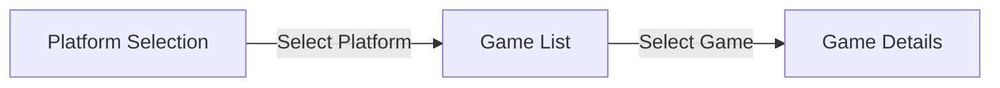
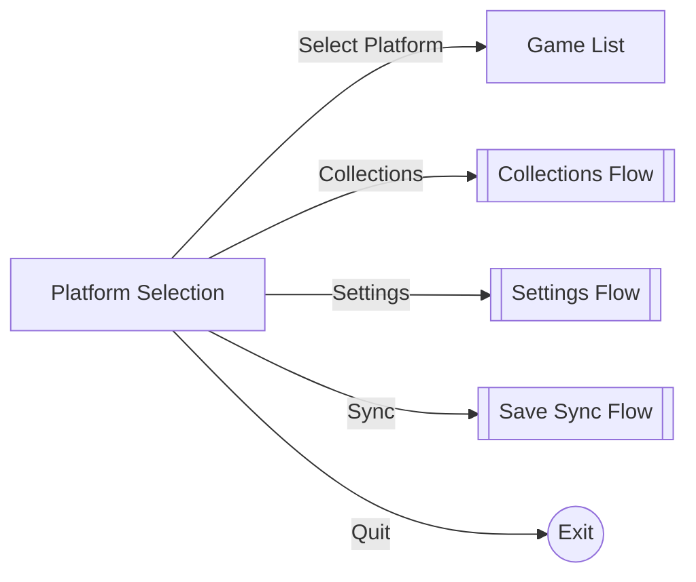
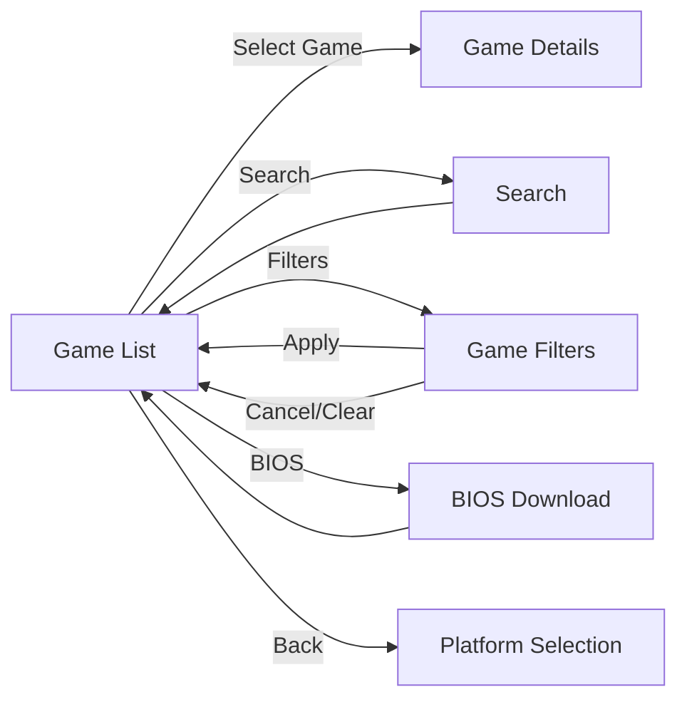
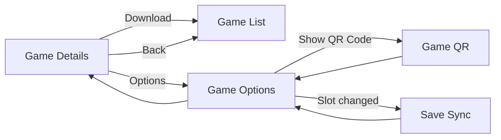
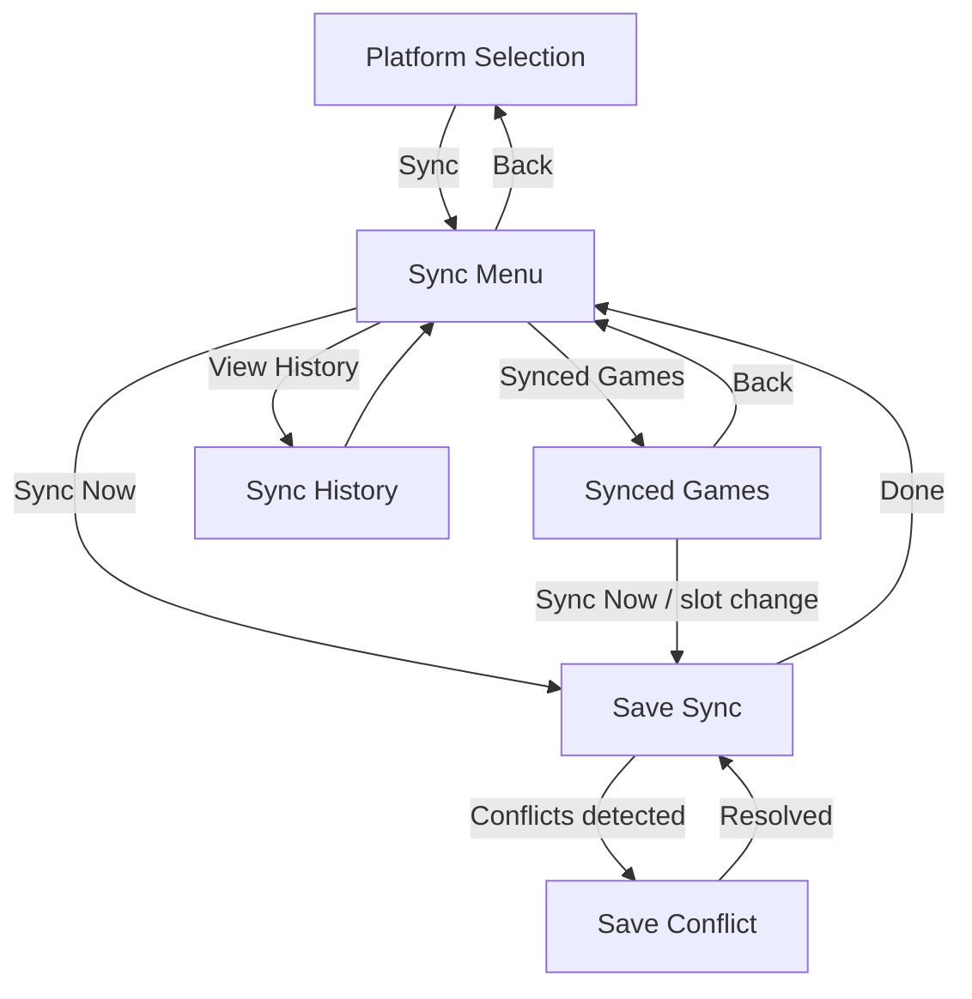
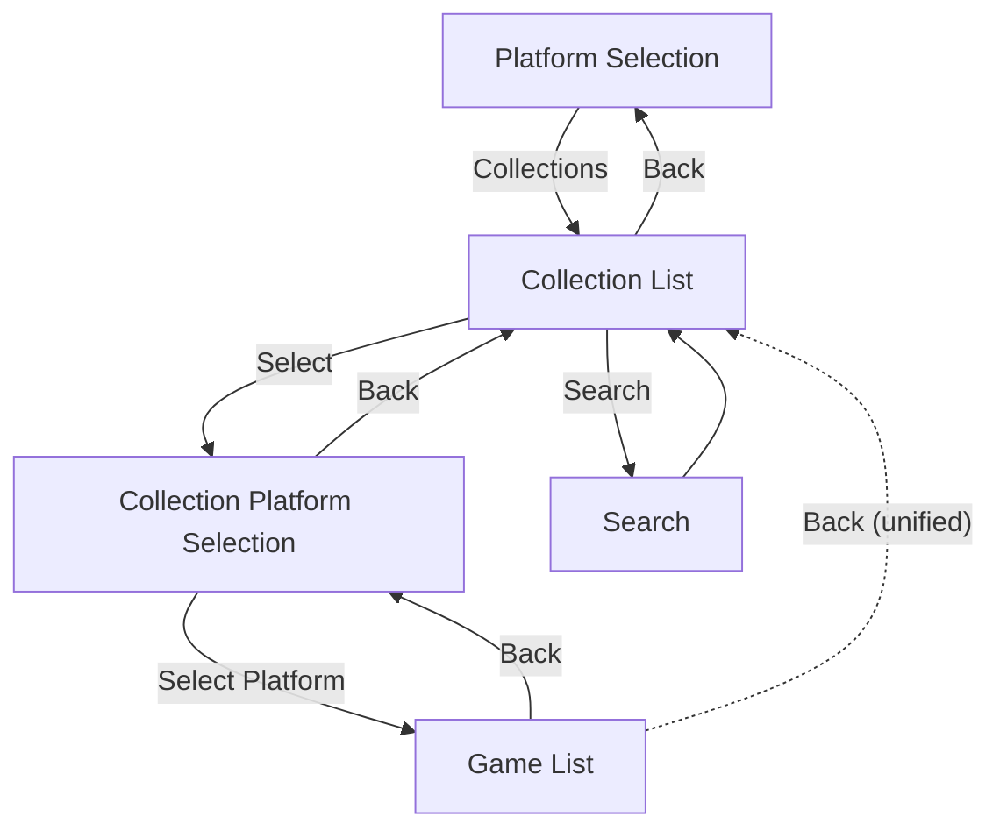
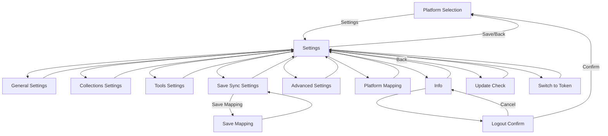
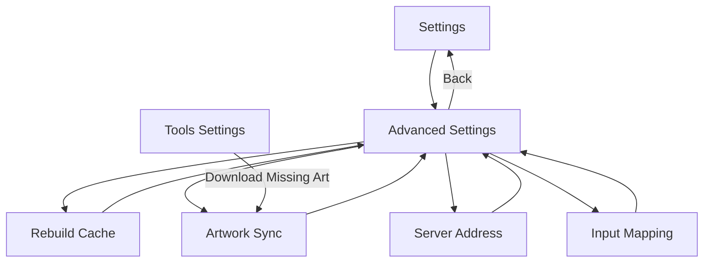

---
search:
  exclude: true
---

# State Machine Reference

This document shows the navigation flow between screens in Grout.

---

## Overview

```mermaid
flowchart LR
    PS[Platform Selection] -->|"Select Platform"| GL[Game List] -->|"Select Game"| GD[Game Details]
```

## Platform Selection

```mermaid
flowchart LR
    PS[Platform Selection]
    PS -->|"Select Platform"| GL[Game List]
    PS -->|"Collections"| COLL[["Collections Flow"]]
    PS -->|"Settings"| SETT[["Settings Flow"]]
    PS -->|"Sync"| SM[["Save Sync Flow"]]
    PS -->|"Quit"| EXIT((Exit))
```

## Game List

```mermaid
flowchart LR
    GL[Game List]
    GL -->|"Select Game"| GD[Game Details]
    GL -->|"Search"| S[Search] --> GL
    GL -->|"Filters"| GF[Game Filters]
    GF -->|"Apply"| GL
    GF -->|"Cancel/Clear"| GL
    GL -->|"BIOS"| BIOS[BIOS Download] --> GL
    GL -->|"Back"| PS[Platform Selection]
```

## Game Details

```mermaid
flowchart LR
    GD[Game Details]
    GD -->|"Download"| GL[Game List]
    GD -->|"Options"| GO[Game Options] --> GD
    GO -->|"Show QR Code"| QR[Game QR] --> GO
    GO -->|"Slot changed"| SS[Save Sync] --> GO
    GD -->|"Back"| GL
```

---

## Save Sync Flow

```mermaid
flowchart TD
    PS[Platform Selection]
    SM[Sync Menu]
    SS[Save Sync]
    SC[Save Conflict]
    SG[Synced Games]
    SH[Sync History]

    PS -->|"Sync"| SM
    SM -->|"Sync Now"| SS
    SM -->|"Synced Games"| SG
    SM -->|"View History"| SH
    SM -->|"Back"| PS

    SS -->|"Conflicts detected"| SC
    SC -->|"Resolved"| SS
    SS -->|"Done"| SM

    SG -->|"Sync Now / slot change"| SS
    SG -->|"Back"| SM
    SH --> SM
```

---

## Collections Flow

```mermaid
flowchart TD
    PS[Platform Selection]
    CL[Collection List]
    CPS[Collection Platform Selection]
    GL[Game List]
    S[Search]

    PS -->|"Collections"| CL
    CL -->|"Select"| CPS
    CL -->|"Search"| S
    CL -->|"Back"| PS

    CPS -->|"Select Platform"| GL
    CPS -->|"Back"| CL

    S --> CL

    GL -->|"Back"| CPS
    GL -.->|"Back (unified)"| CL
```

---

## Settings Flow

```mermaid
flowchart TD
    PS[Platform Selection]
    SET[Settings]
    GSET[General Settings]
    CSET[Collections Settings]
    TSET[Tools Settings]
    SSSET[Save Sync Settings]
    SMAP[Save Mapping]
    ASET[Advanced Settings]
    PM[Platform Mapping]
    INFO[Info]
    UPD[Update Check]
    STT[Switch to Token]
    LOGOUT[Logout Confirm]

    PS -->|"Settings"| SET
    SET -->|"Save/Back"| PS
    SET --> GSET
    SET --> CSET
    SET --> TSET
    SET --> SSSET
    SET --> ASET
    SET --> PM
    SET --> INFO
    SET --> UPD
    SET --> STT

    GSET --> SET
    CSET --> SET
    TSET --> SET
    SSSET --> SET
    ASET --> SET
    PM --> SET
    UPD --> SET
    STT --> SET

    SSSET -->|"Save Mapping"| SMAP --> SSSET

    INFO -->|"Back"| SET
    INFO --> LOGOUT

    LOGOUT -->|"Cancel"| INFO
    LOGOUT -->|"Confirm"| PS
```

---

## Advanced Settings Flow

```mermaid
flowchart TD
    SET[Settings]
    ASET[Advanced Settings]
    TSET[Tools Settings]
    RC[Rebuild Cache]
    ART[Artwork Sync]
    SA[Server Address]
    IM[Input Mapping]

    SET --> ASET
    ASET -->|"Back"| SET
    ASET --> RC
    ASET --> ART
    ASET --> SA
    ASET --> IM

    RC --> ASET
    ART --> ASET
    SA --> ASET
    IM --> ASET

    TSET -->|"Download Missing Art"| ART
```

---

## State Descriptions

| State                         | Description                                                                                                                                                          |
|-------------------------------|----------------------------------------------------------------------------------------------------------------------------------------------------------------------|
| Platform Selection            | Main menu showing platforms and collections                                                                                                                          |
| Game List                     | List of games for selected platform/collection                                                                                                                       |
| Game Details                  | Detailed view with metadata and download                                                                                                                             |
| Game Options                  | Per-game settings (save slot, QR code)                                                                                                                               |
| Game QR                       | QR code linking to the game on the RomM server                                                                                                                       |
| Game Filters                  | Filter games by genre, franchise, platform, etc. Changing a filter dynamically updates available options for other filters and clears selections that become invalid |
| Search                        | On-screen keyboard for game and collection search (shared screen)                                                                                                    |
| Collection List               | List of available collections                                                                                                                                        |
| Collection Platform Selection | Platform filter within a collection                                                                                                                                  |
| Settings                      | Main settings menu                                                                                                                                                   |
| General Settings              | Box art, download behavior, language                                                                                                                                 |
| Collections Settings          | Collection display options                                                                                                                                           |
| Tools Settings                | Download missing art, Kid Mode                                                                                                                                       |
| Save Sync Settings            | Device registration, save mapping, backup retention                                                                                                                  |
| Save Mapping                  | Choose the emulator save directory per platform                                                                                                                      |
| Advanced Settings             | Timeouts, cache management, server address, input mapping                                                                                                            |
| Platform Mapping              | Configure ROM directory mappings                                                                                                                                     |
| Rebuild Cache                 | Select and rebuild cache types                                                                                                                                       |
| Artwork Sync                  | Pre-cache artwork for all games                                                                                                                                      |
| Server Address                | Change the RomM server URL                                                                                                                                           |
| Input Mapping                 | Remap physical buttons                                                                                                                                               |
| Info                          | App info (version, CFW, RomM version) and logout option                                                                                                              |
| Switch to Token               | Replace credential auth with an API token                                                                                                                            |
| Update Check                  | Check for and install updates                                                                                                                                        |
| Logout Confirmation           | Confirm logout action                                                                                                                                                |
| Sync Menu                     | Hub for save sync actions (sync now, synced games, history)                                                                                                          |
| Save Sync                     | Manual save synchronization                                                                                                                                          |
| Save Conflict                 | Resolve conflicting saves (Skip / Keep Local / Keep Remote)                                                                                                          |
| Synced Games                  | Browse synced games and manage save slots                                                                                                                            |
| Sync History                  | Chronological log of sync actions for this device                                                                                                                    |
| BIOS Download                 | Download BIOS files                                                                                                                                                  |
