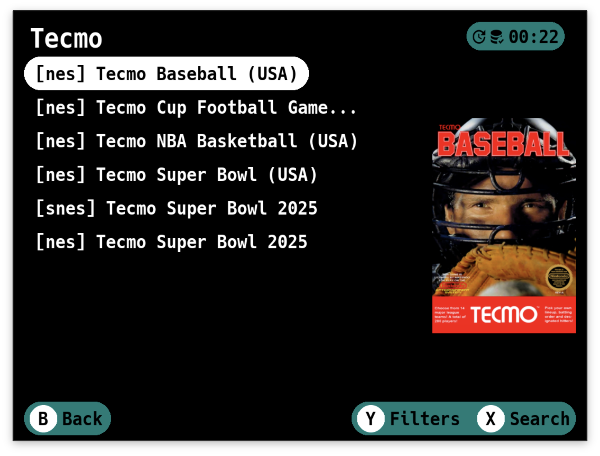
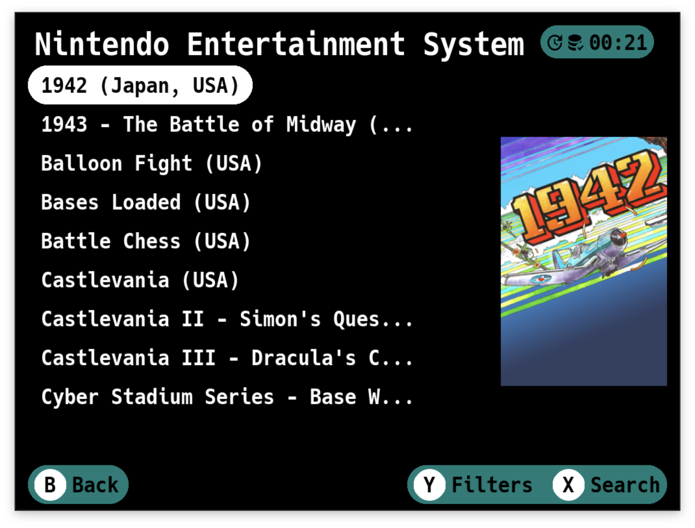
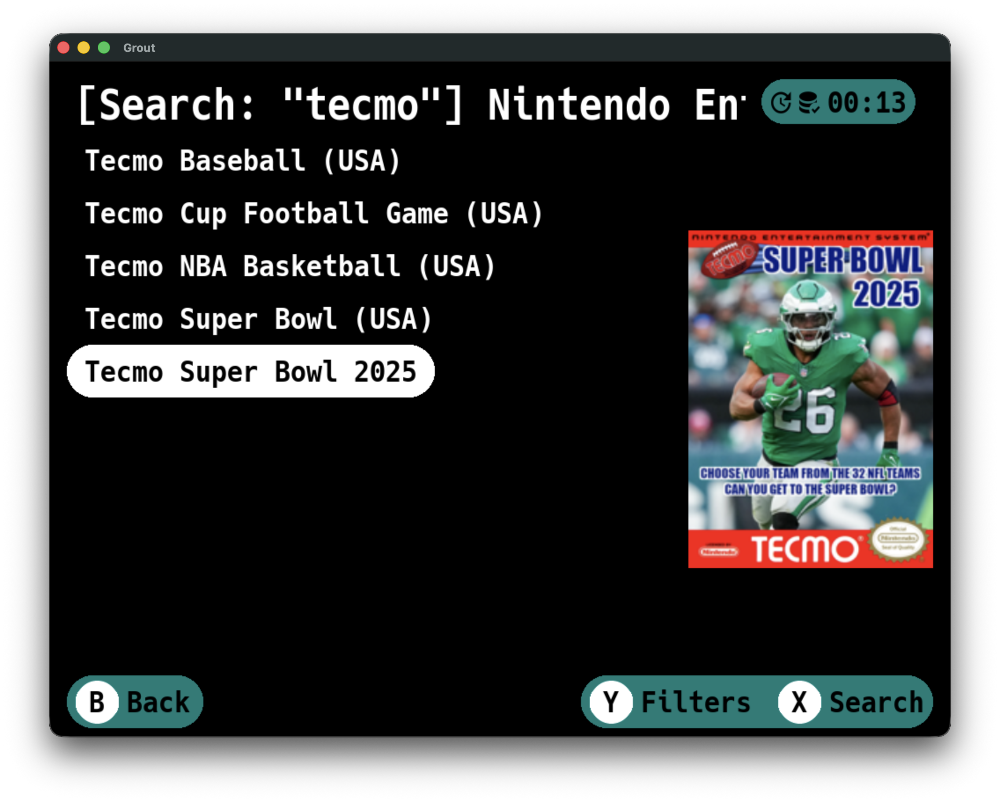
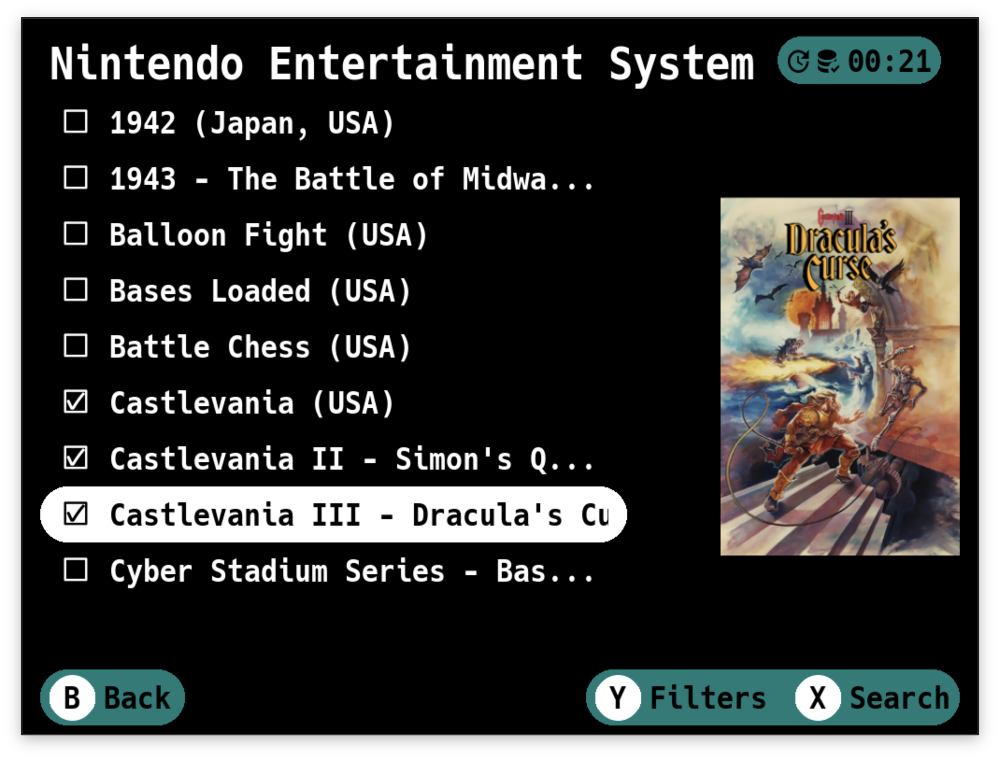
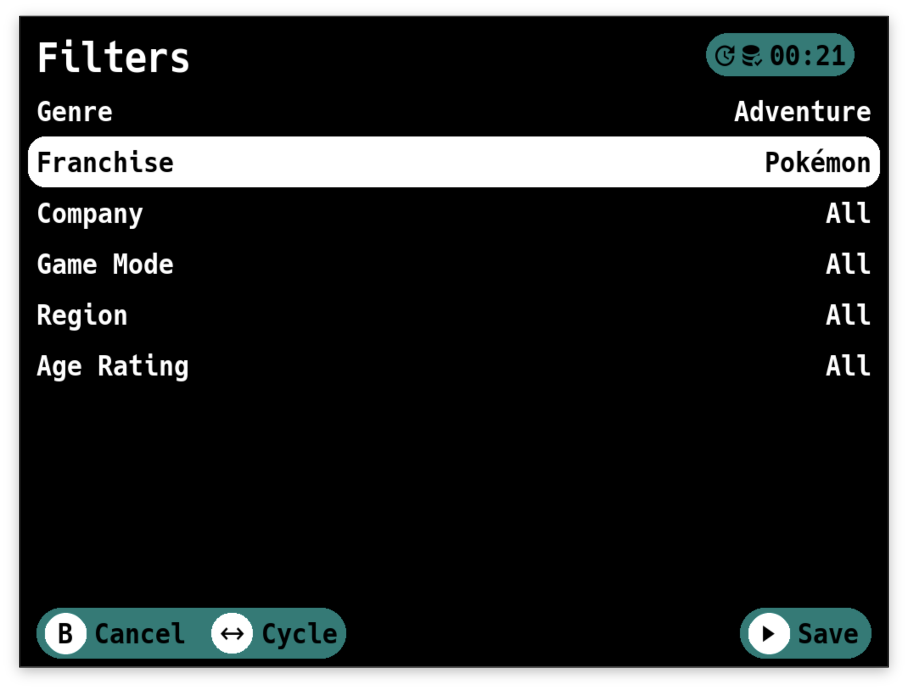
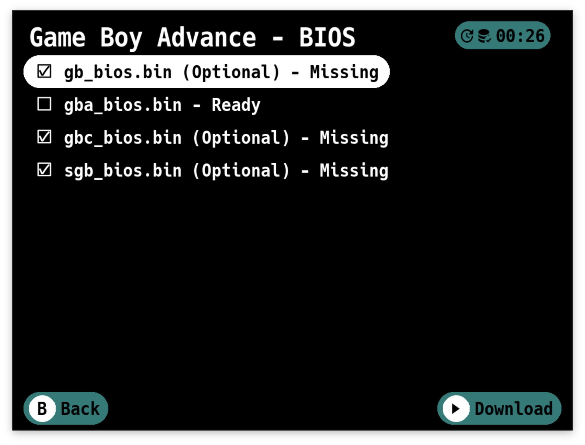

# User Guide

This guide walks you through using Grout to download games from your RomM instance.

!!! important
    Grout aggressively adopts new RomM features. The required RomM version matches the first three components of Grout's version number. The fourth component is for Grout-specific patches.

## Button Reference

Grout attempts to be consistent with its controls. Here's a quick reference:

| Button       | Description                               |
|--------------|-------------------------------------------|
| `A`          | Confirm / Select                          |
| `B`          | Back / Cancel                             |
| `X`          | Secondary action (Search, Settings)       |
| `Y`          | Tertiary action (Filters, Save Sync, Game Options) |
| `Start`      | Confirm / Save settings                   |
| `Select`     | Toggle list mode (multi-select, reorder)  |
| `L1` / `R1`  | Shoulder buttons (used in button combos)  |
| `Menu`       | Context action (BIOS, also used in button combos) |
| `Up/Down`    | Navigate lists                            |
| `Left/Right` | Cycle options / Jump pages in list        |

## Status Bar Icons

The status bar displays icons to indicate background activity. Here's what each icon means:

### Cache Sync Icons

These icons appear during the [background cache sync](#background-cache-sync) process:

| Icon                                                                                              | Description |
|---------------------------------------------------------------------------------------------------|---|
| { width="50" }   | Cache sync in progress |
| { width="50" } | Cache sync completed successfully |
| { width="50" } | Cache sync encountered an error |

### Save Sync Icons

These icons appear during [Save Sync](save-sync.md) operations:

| Icon | Description |
|---|---|
| { width="50" } | Save sync in progress |
| { width="50" } | Uploading saves to RomM |
| { width="50" } | Downloading saves from RomM |
| { width="50" } | Save sync completed successfully |
| { width="50" } | Save sync encountered an error, check the log file |

## First Launch and Login

### Language Selection

When you first launch Grout, you'll be asked to select your preferred language. Grout supports:

- English
- Deutsch (German)
- Espanol (Spanish)
- Francais (French)
- Italiano (Italian)
- Portugues (Portuguese)
- Russian
- Japanese

Use `Left/Right` to cycle through the available languages. Press `A` to confirm your selection.

You can change your language later from the [Settings](settings.md#language).

### Login

1. **Protocol** - Choose between HTTP and HTTPS.
2. **Hostname** - Enter your RomM server address without the protocol.
3. **Port (optional)** - If your RomM instance runs on a non-standard port, enter it here.
4. **Username** - Your RomM username.
5. **Password** - Your RomM password.
6. **SSL Certificates** (HTTPS only) - Choose whether to verify SSL certificates:
    - **Verify** - Validate SSL certificates (recommended)
    - **Skip Verification** - Skip SSL certificate validation (useful for self-signed certificates or internal CAs)

Use the left and right buttons to cycle through options for Protocol. For the text fields (Hostname, Username,
Password), pressing `A` will open an on-screen keyboard.

Press `Start` to login. If your credentials are correct and Grout can reach your server, you'll move
to the next step. If something goes wrong, you'll get a message telling you what happened, and you can try again.

!!! tip
    If you're using a self-signed certificate or a certificate from an internal Certificate Authority, set
    **SSL Certificates** to **Skip Verification** to avoid connection errors.

!!! important
    **OIDC Users:** If your RomM instance uses OIDC authentication, you can still use Grout by setting a password for your
    user account. Grout will support API Keys once they are available in RomM. For more details,
    see [this GitHub issue](https://github.com/rommapp/romm/issues/1767#issuecomment-2744215262).

## Platform Directory Mapping

On this screen, you map your RomM platforms to directories on your device.
This tells Grout where to put the games that you download.

You'll see a list of all platforms from your RomM instance. For each one, you can select:

- **Skip** - Don't map this platform. Games from this platform won't be available to download.
- **Create {Directory Name}** - Create a new directory for this platform. Grout will automatically suggest directory
  names that match your custom firmware's expected structure.
- **/{Existing Directory}** - Map to an existing directory on your device.
- **Custom...** - Enter a custom folder name using the on-screen keyboard. Use this when your folder structure doesn't
  match Grout's suggestions.

Grout tries to be smart about this. If you already have a directory that matches the platform name, it'll be
pre-selected. If not, it'll suggest creating one with the correct name for your firmware.

**Navigation:**

- `Left/Right` to cycle through options for the selected platform
- `A` to open a list picker showing all available options at once
- `Up/Down` to move between platforms
- `Start` to save your mappings

When you select **Custom...**, an on-screen keyboard appears where you can type your desired folder name. If you return
to this screen later, any custom folder names you entered will be remembered and shown in place of "Custom...".

You can change these mappings later from [Settings](settings.md).

### Mappings Reference

Grout uses platform mappings to determine where to save downloaded games on your device. Each Custom Firmware (CFW) uses
different folder naming conventions. Use these references to see the exact folder names used by your CFW:

- [KNULLI](../platforms/knulli.md) - ES-DE style folder names (e.g., `gb`, `snes`, `psx`)
- [muOS](../platforms/muos.md) - Mixed short codes and descriptive names (e.g., `gb`, `Nintendo Game Boy`)
- [NextUI](../platforms/nextui.md) - Descriptive names with tags (e.g., `Game Boy (GB)`)
- [ROCKNIX](../platforms/rocknix.md) - ES-DE style folder names (e.g., `gb`, `snes`, `psx`)
- [Spruce](../platforms/spruce.md) - Uppercase short codes (e.g., `GB`, `SFC`, `PS`)

## Background Cache Sync

!!! warning
    Grout currently does not gracefully handle deletions.

    Deleted games, platforms and collections will continue to be shown until
    the [local cache is rebuilt](settings.md#rebuild-cache).

    We are waiting for updated API endpoints that will allow Grout to remove deleted items from the cache without a
    rebuild. You can track the progress of this in [this issue](https://github.com/rommapp/grout/issues/83).

Grout maintains a local cache of your RomM library data (platforms, games, and collections) to provide a fast,
responsive browsing experience. This cache syncs automatically in the background each time you launch Grout.

**How it works:**

- On startup, Grout begins syncing in the background while you can immediately start browsing
- A sync icon appears in the status bar during the sync process
- Grout uses incremental updates, only fetching data that has changed since your last session
- When complete, the sync icon updates to indicate success

**First launch:**

On your very first launch (after platform mapping), Grout builds the initial cache.

This may take a moment depending on the size of your library.

!!! tip
    If you need to completely rebuild the cache from scratch, use **Rebuild Cache** in
    [Advanced Settings](settings.md#rebuild-cache).

## Browsing Games

### Main Menu

")

At the top, you'll see "Collections" (if you have any collections set up in RomM). Below that, you'll see all your RomM
platforms - NES, SNES, PlayStation, whatever you've got.

**Navigation:**

- `Up/Down` to scroll through platforms
- `A` to select a platform or collection
- `X` to open Settings
- `Y` to open the Save Sync menu (when Save Sync is enabled in Manual mode, or when issues occur in Automatic mode)
- `Select` to enter reordering mode
- `B` to quit Grout

**Reordering Platforms:**

Press `Select` to enter reordering mode. An arrow will appear next to the currently selected platform.

While in this mode:

- `Up/Down` to move the platform one position
- `Left/Right` to move the platform one page at a time
- `A` to place the platform into its new position

Your custom platform order is automatically saved to the config and will persist across sessions.

### Collections

Grout has two views for collections. You can choose this view in the Settings > Collections menu.

**Platform** - After selecting a collection, you'll see a platform selection screen showing all platforms in that
collection. Select a platform to view games from only that platform.

**Unified** - After selecting a collection, you'll immediately see all games from all platforms with platform slugs
shown as prefixes (e.g., `[nes] Tetris`, `[snes] Tetris Battle Gaiden`)

!!! warning
    If you skipped a platform in the mapping screen, you won't see games for that platform in your collections.

!!! tip
    Regular collections, smart collections, and virtual collections can be toggled on/off
    in [Settings](settings.md#collections-settings).

### Game List

The title bar shows you where you are - either a platform name or a collection name.

If you entered a search query, you'll see `[Search: "your search term"] | Platform / Collection Name`.

**Navigation and Selection:**

- `Up/Down` to scroll through games
- `Left/Right` to skip entire pages
- `A` to select a single game
- `Select` to enter multi-select mode, then use `A` to select/deselect games
- `X` to open the search keyboard
- `Y` to open filters
- `Menu` to access BIOS downloads (when available)
- `B` to go back

**Multi-Select Mode:**

Press `Select` once to enable multi-select. You'll see checkboxes appear next to each game. Now when you press `A` on a
game, it toggles selection instead of immediately downloading. This is perfect when you want to grab a bunch of games at
once.

Check all the ones you want, then press `Start` to confirm your selections.

!!! tip
    Box art must be enabled in [Settings](settings.md#box-art) for it to appear.

### Filters

Press `Y` from any game list to open the filters screen. You can filter games by:

- Genre
- Franchise
- Company
- Game Mode
- Region
- Language
- Age Rating
- Tag

Only filter categories that have values for the current platform are shown. When a filter is active, the title bar displays `[Filtered]`. Press `B` to clear all filters and return to the full list.

### Search

Press `X` from any game list to search.

Type your search term using the on-screen keyboard and confirm. The game list will filter to show only matching titles.
The search is case-insensitive and matches anywhere in the game name.

To clear a search and return to the full list, press `B`.

## Game Details

You'll see:

- **Cover art** - The game's box art (if available)
- **File Version dropdown** - If the game has multiple file versions (like different regions or revisions), use this
  dropdown to select which version to download. Already-downloaded versions are marked with a download icon.
- **Summary** - A description of the game
- **Metadata** - Release date, genres, developers/publishers, game modes, regions, languages, and file size
- **Multi-file indicator** - If the game has multiple files (like multi-disc PlayStation games)
- **QR code** - Scan this to view the game's page on your RomM web interface

From here:

- `A` to download the game (or `X` if a file version dropdown is present)
- `Y` to open Game Options
- `B` to go back without downloading

### File Version Selection

Some games in RomM may have multiple file versions - for example, different regional releases (USA, Europe, Japan) or
different revisions (Rev A, Rev B). When a game has multiple versions available:

1. A **File Version** dropdown appears on the game details screen
2. Use `Up/Down` to scroll to the dropdown, then press `A` to expand it
3. Select the version you want to download
4. Versions you've already downloaded are marked with a download icon prefix
5. Press `X` to download the selected version

### Game Options

- **Save Directory** - Choose which emulator's save folder this game should use. This overrides the platform-wide
  setting configured in Save Sync Mappings. When changed, Grout automatically moves existing save files to the new
  location. This is useful when you use different emulators for specific games within the same platform.

!!! important
    **Kids Mode Impact:** When Kids Mode is enabled, the Game Options screen is hidden.
    See [Settings Reference](settings.md#kids-mode) to learn how to temporarily or permanently disable Kids Mode.

## Downloading Games

After you've selected games (either from the game list or game details screen), the download manager kicks in.

You'll see a progress bar and a list of games being downloaded. Grout downloads your ROMs directly from RomM to the
appropriate directory on your device. Press `Y` to cancel the download.

**What Happens During Download:**

1. **ROM files are downloaded** - The game files are saved to the correct platform directory you mapped earlier.

2. **Multi-file games are extracted automatically** - If you're downloading a multi-disc game, Grout downloads a zip
   file, extracts it, and creates an M3U playlist file so your emulator can handle disc switching.

3. **Artwork is downloaded** - If "Download Art" is enabled in Settings, Grout downloads box art for each game to your
   artwork directory after the ROMs finish. This artwork is only displayed within Grout — it does not affect artwork shown in your CFW's game list.

4. **Archived files are extracted automatically** - If "Archived Downloads" is set to "Uncompress" in Settings, Grout
   will extract zip and 7z files to the configured ROM directory and then delete the archive.

If a download fails, Grout will show you which games had problems and clean up any leftover cruft.

When everything's done, you're dropped back to the game list. The games you just downloaded are now on your device and
ready to play.

## BIOS Files

Many emulators require BIOS files to function properly. Grout can download these files directly from your RomM server to
the correct location on your device.

!!! important
    **Kids Mode Impact:** When Kids Mode is enabled, the BIOS download screen is hidden.
    See [Settings Reference](settings.md#kids-mode) to learn how to temporarily or permanently disable Kids Mode.

### Accessing BIOS Downloads

From the game list, press `Menu` on a platform that has BIOS files available in your RomM library. You'll see
a "BIOS" option in the footer when BIOS files are available for that platform.

## Spread Joy!

A significant amount of time has been spent building Grout.

If you enjoy using Grout and feel inclined to pay it forward, go do something nice for someone!
