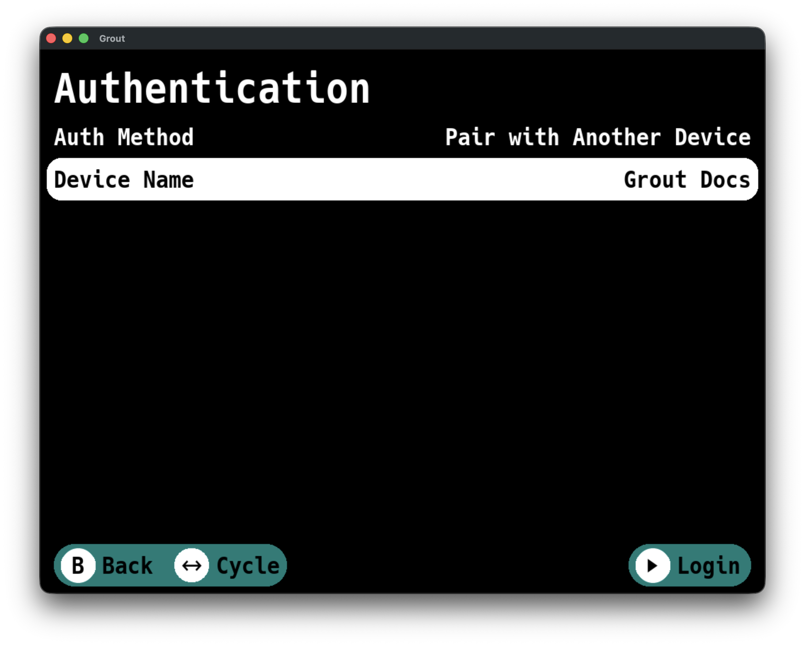
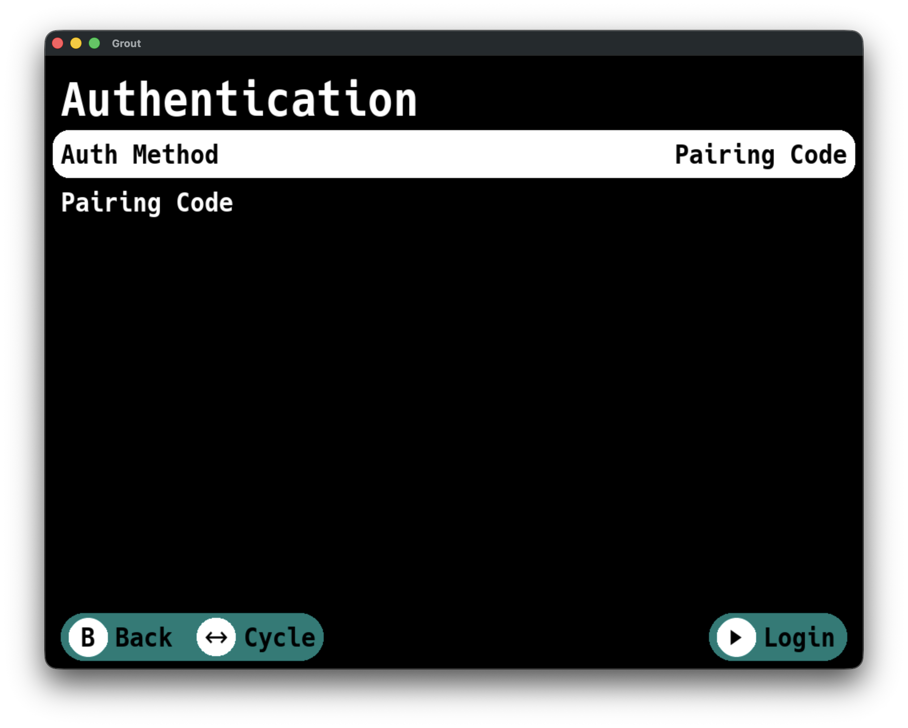
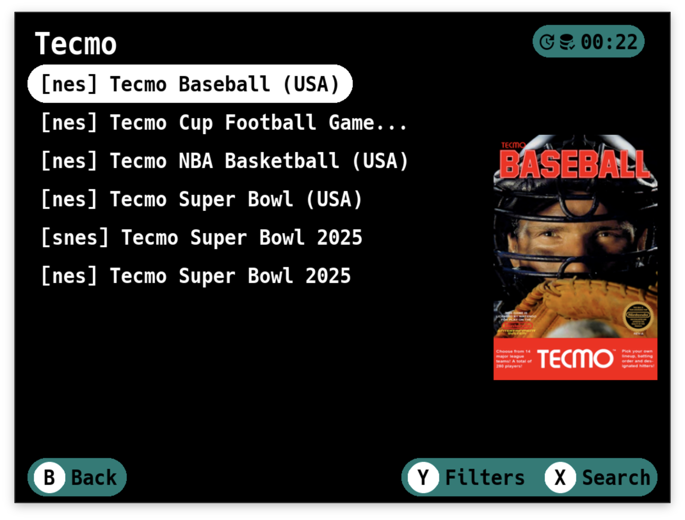
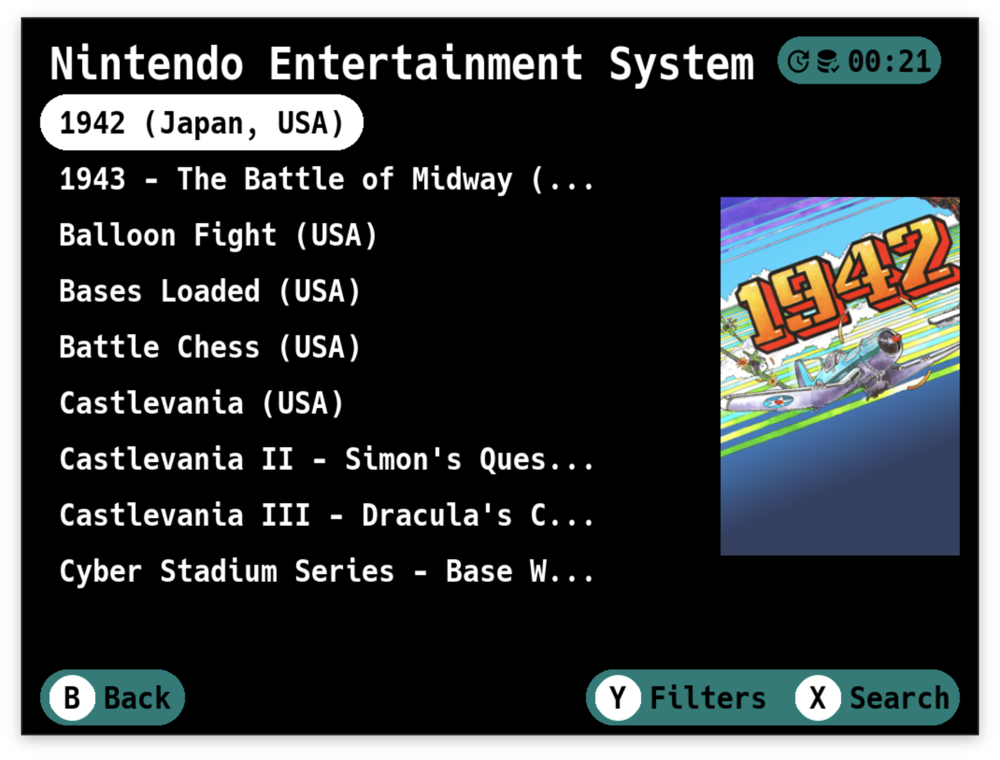
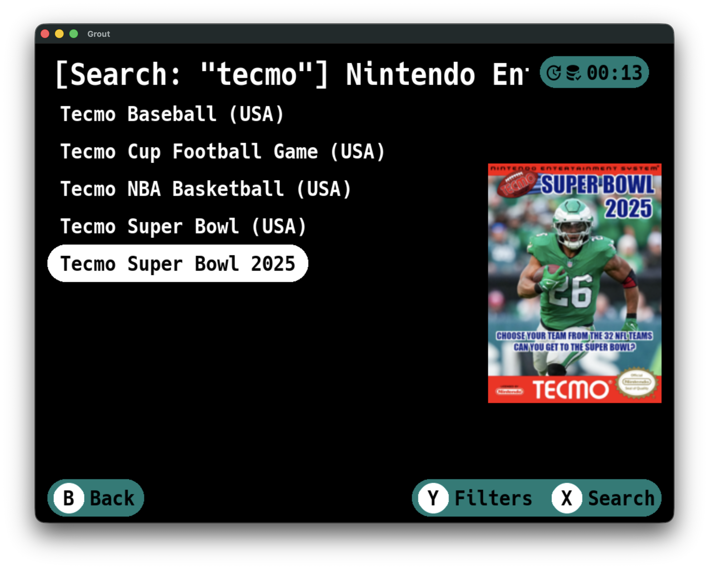
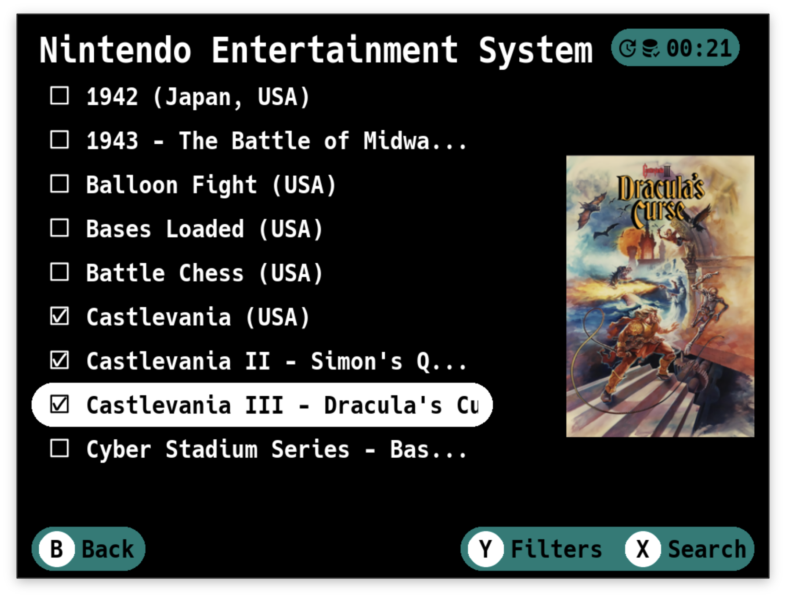
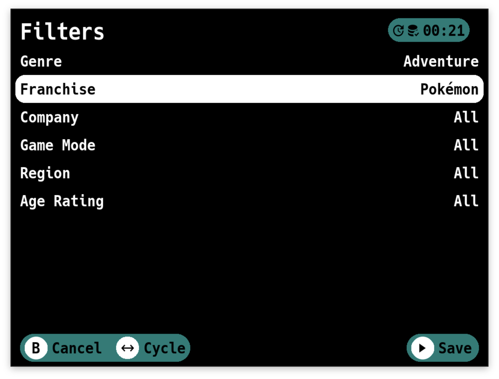
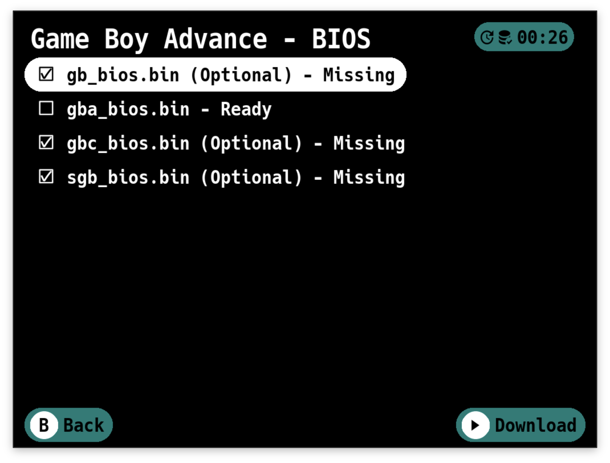

# User Guide

This guide walks you through using Grout to download games from your RomM instance.

> [!IMPORTANT]
> Grout aggressively adopts new RomM features. The required RomM version matches the first three components of Grout's version number.

For a quick lookup of button controls and status-bar icons, see the [Reference](reference.md) page.

## First Launch and Login

### Language Selection

When you first launch Grout, you'll be asked to select your preferred language. Grout supports:

- English
- Deutsch (German)
- Espanol (Spanish)
- Francais (French)
- Italiano (Italian)
- Portugues (Portuguese)
- Russian
- Japanese

Use `Left/Right` to cycle through the available languages. Press `A` to confirm your selection.

You can change your language later from the [Settings](settings.md#language).

### Server Connection

First, enter your server connection details:

1. **Protocol** - Choose between HTTP and HTTPS using `Left/Right`.
2. **Hostname** - Enter your RomM server address without the protocol.
3. **Port** (optional) - If your RomM instance runs on a non-standard port, enter it here.
4. **SSL Certificates** (HTTPS only) - Choose whether to verify SSL certificates:
    - **Verify** - Validate SSL certificates (recommended)
    - **Skip Verification** - Skip SSL certificate validation (useful for self-signed certificates or internal CAs)

### Authentication

After connecting to your server, Grout authenticates using an API token. Tokens can be revoked individually and work
with all RomM authentication setups, including OIDC. How you obtain the token depends on your RomM version:

- **RomM 5.0 or newer** - Grout shows an **Auth Method** picker with two choices: **Pair with Another Device** (the
  default) and **Pairing Code**.
- **Older RomM servers** - Only the **Pairing Code** flow is available, so no picker is shown.

The token is saved to your device and used for all future connections.

> [!TIP]
> You can view token details (name, expiry) on the [Grout Info](settings.md#main-settings) screen.

#### Device Pairing

On RomM 5.0+, **Pair with Another Device** is the default and recommended method. You approve the handheld from your
RomM web interface, so there's no long code to type on the device.

1. Select **Pair with Another Device** as the auth method (it's the default on RomM 5.0+).
2. Set a **Device Name**. Grout suggests your device's hostname. This name also identifies the device for
   [Save Sync](save-sync.md).
3. Press `Start` to begin pairing. Grout displays a QR code.
4. Scan the QR code with your phone (or another device) to open the pairing approval page in your RomM web interface,
   then approve the device.
5. Once you approve, Grout automatically receives its API token and continues to the next step. Press `B` to cancel.

Device Pairing requests all the scopes Grout needs automatically, so there's nothing else to configure.

#### Pairing Code

Use the Pairing Code flow on older RomM servers, or select it from the **Auth Method** picker on RomM 5.0+. You
generate a code in the RomM web interface and type it into Grout, which exchanges it for an API token.

1. In your RomM web interface, open **Client API Tokens** and generate a pairing code.
2. In Grout, select **Pairing Code** as the auth method (on older servers this is the only option).
3. Enter the code using the on-screen keyboard.
4. Press `Start` to log in - Grout exchanges the code for an API token automatically.

**Required token permissions:**

When creating a token for Grout, ensure it has the following scopes:

| Scope              | Purpose                     |
|--------------------|-----------------------------|
| `me.read`          | Read your user profile      |
| `platforms.read`   | List platforms              |
| `roms.read`        | Browse and search ROMs      |
| `collections.read` | Browse collections          |
| `firmware.read`    | Download BIOS files         |
| `assets.read`      | Download saves and artwork  |
| `assets.write`     | Upload saves and screenshots|
| `devices.read`     | Read device registrations   |
| `devices.write`    | Register and update devices |

> [!TIP]
> Save Sync specifically needs `assets.read`, `assets.write`, `devices.read`, and `devices.write`. Grout warns you
> (without blocking) if your token is missing any of these.

## Platform Directory Mapping

On this screen, you map your RomM platforms to directories on your device.
This tells Grout where to put the games that you download.

You'll see a list of all platforms from your RomM instance. For each one, you can select:

- **Skip** - Don't map this platform. Games from this platform won't be available to download.
- **Create {Directory Name}** - Create a new directory for this platform. Grout will automatically suggest directory
  names that match your custom firmware's expected structure.
- **/{Existing Directory}** - Map to an existing directory on your device.
- **Custom...** - Enter a custom folder name using the on-screen keyboard. Use this when your folder structure doesn't
  match Grout's suggestions.

Grout tries to be smart about this. If you already have a directory that matches the platform name, it'll be
pre-selected. If not, it'll suggest creating one with the correct name for your firmware.

**Navigation:**

- `Left/Right` to cycle through options for the selected platform
- `A` to open a list picker showing all available options at once
- `Up/Down` to move between platforms
- `Y` to open filters (Mapping Status, Generation, Category, Family) to narrow the platform list — inside, `X` resets
  all filters and `Start` applies them
- `Start` to save your mappings

When you select **Custom...**, an on-screen keyboard appears where you can type your desired folder name. If you return
to this screen later, any custom folder names you entered will be remembered and shown in place of "Custom...".

You can change these mappings later from [Settings](settings.md#directory-mappings).

### Mappings Reference

Grout uses platform mappings to determine where to save downloaded games on your device. Each Custom Firmware (CFW) uses
different folder naming conventions. Use these references to see the exact folder names used by your CFW:

--8<-- "docs/_includes/mappings-reference.md"

## Background Cache Sync

Grout maintains a local cache of your RomM library data (platforms, games, and collections) to provide a fast,
responsive browsing experience. This cache syncs automatically in the background each time you launch Grout.

**How it works:**

- On startup, Grout begins syncing in the background while you can immediately start browsing
- A sync icon appears in the status bar during the sync process
- Grout uses incremental updates, only fetching data that has changed since your last session
- Games, platforms, and collections deleted on the server are removed from the cache automatically
- When complete, the sync icon updates to indicate success

**First launch:**

On your very first launch (after platform mapping), Grout builds the initial cache.

This may take a moment depending on the size of your library.

> [!TIP]
> If you need to completely rebuild the cache from scratch, use **Rebuild Cache** in
> [Advanced Settings](settings.md#rebuild-cache).

## Browsing Games

### Main Menu

")

At the top, you'll see "Collections" (if you have any collections set up in RomM). Below that, you'll see all your RomM
platforms - NES, SNES, PlayStation, whatever you've got.

**Navigation:**

- `Up/Down` to scroll through platforms
- `A` to select a platform or collection
- `X` to open Settings
- `Y` to open the Sync Menu (shown when a device is registered for Save Sync; hidden in Kid Mode)
- `Select` to enter reordering mode
- `B` to quit Grout

**Reordering Platforms:**

Press `Select` to enter reordering mode. An arrow will appear next to the currently selected platform.

While in this mode:

- `Up/Down` to move the platform one position
- `Left/Right` to move the platform one page at a time
- `A` to place the platform into its new position

Your custom platform order is automatically saved to the config and will persist across sessions.

### Collections

Grout has two views for collections. You can choose this view in the Settings > Collections menu.

**Platform** - After selecting a collection, you'll see a platform selection screen showing all platforms in that
collection. Select a platform to view games from only that platform.

**Unified** - After selecting a collection, you'll immediately see all games from all platforms with platform slugs
shown as prefixes (e.g., `[nes] Tetris`, `[snes] Tetris Battle Gaiden`)

> [!WARNING]
> If you skipped a platform in the mapping screen, you won't see games for that platform in your collections.

> [!TIP]
> Regular collections, smart collections, and virtual collections can be toggled on/off
> in [Settings](settings.md#collections-settings).

### Game List

The title bar shows you where you are - either a platform name or a collection name.

If you entered a search query, you'll see `[Search: "your search term"] | Platform / Collection Name`.

**Navigation and Selection:**

- `Up/Down` to scroll through games
- `Left/Right` to skip entire pages
- `L1` / `R1` to jump to the previous/next letter group
- `A` to select a single game
- `Select` to enter multi-select mode, then use `A` to select/deselect games
- `X` to open the search keyboard
- `Y` to open filters
- `Menu` (or `L2` on Miyoo devices) to access BIOS downloads (when available)
- `B` to go back (clears the active search or filters first, most recent first)

**Multi-Select Mode:**

Press `Select` once to enable multi-select. You'll see checkboxes appear next to each game. Now when you press `A` on a
game, it toggles selection instead of immediately downloading. This is perfect when you want to grab a bunch of games at
once.

Check all the ones you want, then press `Start` to confirm your selections.

While in multi-select mode:

- `R1` to select all games
- `L1` to deselect all games
- `Select` again to exit multi-select mode

> [!TIP]
> Box art must be enabled in [Settings](settings.md#box-art) for it to appear.

### Filters

Press `Y` from any game list to open the filters screen. You can filter games by:

- Genre
- Franchise
- Company
- Game Mode
- Region
- Language
- Age Rating
- Tag

Only filter categories that have values for the current platform are shown. On the filters screen, use `Left/Right` to
cycle a filter's values (or press `A` to open a list picker), then press `Start` to apply or `B` to cancel.

When a filter is active, the title bar displays `[Filtered]`. Pressing `B` in the game list clears the active search
and filters — most recently applied first — before going back.

### Search

Press `X` from any game list to search.

Type your search term using the on-screen keyboard and confirm. The game list will filter to show only matching titles.
The search is case-insensitive and matches anywhere in the game name.

To clear a search and return to the full list, press `B`.

## Game Details

You'll see:

- **Cover art** - The game's box art (if available)
- **File Version dropdown** - If the game has multiple file versions (like different regions or revisions), use this
  dropdown to select which version to download. Already-downloaded versions are marked with a download icon.
- **Summary** - A description of the game
- **Metadata** - Release date, genres, developers/publishers, game modes, regions, languages, and file size
- **Multi-file indicator** - If the game has multiple files (like multi-disc PlayStation games)

From here:

- `A` to download the game (or `X` if a file version dropdown is present)
- `Y` to open Game Options
- `Up/Down` to scroll, `Left/Right` to jump between sections
- `B` to go back without downloading

### File Version Selection

Some games in RomM may have multiple file versions - for example, different regional releases (USA, Europe, Japan) or
different revisions (Rev A, Rev B). When a game has multiple versions available:

1. A **File Version** dropdown appears on the game details screen
2. Use `Up/Down` to scroll to the dropdown, then press `A` to expand it
3. Select the version you want to download
4. Versions you've already downloaded are marked with a download icon prefix
5. Press `X` to download the selected version

### Game Options

- **Save Slot** - Choose which save slot to sync to for this game. Appears when Save Sync is enabled (device
  registered). You can select an existing slot or create a new one with **New Slot...**. Changing the slot triggers
  a sync automatically. See [Save Slots](save-sync.md#save-slots) for details.
- **Show QR Code** - Display a QR code that links to this game's page on your RomM web interface.

> [!IMPORTANT]
> **Kid Mode Impact:** When Kid Mode is enabled, the Game Options screen is hidden.
> See [Settings Reference](settings.md#kid-mode) to learn how to temporarily or permanently disable Kid Mode.

## Downloading Games

After you've selected games (either from the game list or game details screen), the download manager kicks in.

You'll see a progress bar and a list of games being downloaded. Grout downloads your ROMs directly from RomM to the
appropriate directory on your device. Press `Y` to cancel the download, or `X` to toggle the download speed display.

**What Happens During Download:**

1. **ROM files are downloaded** - The game files are saved to the correct platform directory you mapped earlier.

2. **Multi-file games are extracted automatically** - If you're downloading a multi-disc game, Grout downloads a zip
   file, extracts it, and creates an M3U playlist file so your emulator can handle disc switching.

3. **Artwork is downloaded** - If "Download Art" is enabled in Settings, Grout downloads box art for each game to your
   artwork directory after the ROMs finish. This artwork is only displayed within Grout - it does not affect artwork shown in your CFW's game list.

4. **Archived files are extracted automatically** - If "Archived Downloads" is set to "Uncompress" in Settings, Grout
   will extract zip and 7z files to the configured ROM directory and then delete the archive.

If a download fails, Grout will show you which games had problems and clean up any leftover cruft.

When everything's done, you're dropped back to the game list. The games you just downloaded are now on your device and
ready to play.

## BIOS Files

Many emulators require BIOS files to function properly. Grout can download these files directly from your RomM server to
the correct location on your device.

> [!IMPORTANT]
> **Kid Mode Impact:** When Kid Mode is enabled, the BIOS download screen is hidden.
> See [Settings Reference](settings.md#kid-mode) to learn how to temporarily or permanently disable Kid Mode.

### Accessing BIOS Downloads

From the game list, press `Menu` (or `L2` on Miyoo devices) on a platform that has BIOS files available in your RomM
library. You'll see a "BIOS" option in the footer when BIOS files are available for that platform.

On the BIOS screen, missing files are pre-selected. Press `A` to toggle individual files, `Start` to download the
selected files, or `B` to go back.
